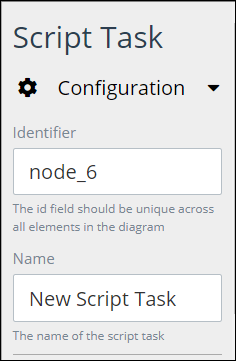
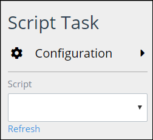
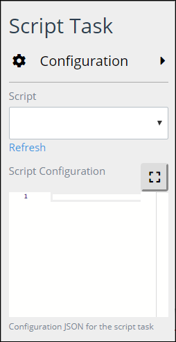

# Add and Configure Script Task Elements

## Add a Script Task Element


### Don't Know What a Script Task Element Is?

See [Process Modeling Element Descriptions](process-modeling-element-descriptions.md) for a description of the [Script Task](process-modeling-element-descriptions.md#script-task) element.

### Permissions Required

Your user account or group membership must have the following permissions to add a Script Task element to the Process model:

* Processes: View Processes
* Processes: Edit Processes

See the [Process](../../../processmaker-administration/permission-descriptions-for-users-and-groups.md#processes) permissions or ask your ProcessMaker Administrator for assistance.


Follow these steps to add a Script Task element to the Process model:

1. [View your Processes](https://processmaker.gitbook.io/processmaker-4-community/-LPblkrcFWowWJ6HZdhC/~/drafts/-LRhVZm0ddxDcGGdN5ZN/primary/designing-processes/viewing-processes/view-the-list-of-processes/view-your-processes#view-all-processes). The **Processes** page displays.
2. [Create a new Process](../../viewing-processes/view-the-list-of-processes/create-a-process.md) or click the **Open Modeler** iconto edit the selected Process model. Process Modeler displays.
3. Locate the **Script Task** element in the **BPMN** panel.

   

4. Drag the element to where in the Process model canvas that you want to place it. If a Pool element is in your Process model, the Script Task element cannot be placed outside of the Pool element.

After the element is placed into the Process model, you may move it by dragging it to the new location.


Moving a Script Task element has the following limitations in regards to the following Process model elements:

* **Pool element:** If the Script Task element is inside of a [Pool](process-modeling-element-descriptions.md#pool) element, it cannot be moved outside of the Pool element. If you attempt to do so, Process Modeler places the Script Task element inside the Pool element closest to where you attempted to move it.
* **Lane element:** If the Script Task element is inside of a Lane element, it can be moved to another Lane element in the same Pool element. However, the Script Task element cannot be move outside of the Pool element.


## Configure a Script Task Element


Your user account or group membership must have the following permissions to configure a Script Task element:

* Processes: View Processes
* Processes: Edit Processes

See the [Process](../../../processmaker-administration/permission-descriptions-for-users-and-groups.md#processes) permissions or ask your ProcessMaker Administrator for assistance.


### Edit the Identifier Value

Process Modeler automatically assigns a unique value to each Process element added to a Process model. However, an element's identifier value can be changed if it is unique.


All identifier values for all elements in the Process model must be unique.


Follow these steps to edit the identifier value for a Script Task element:

1. Select the Script Task element from the Process model in which to edit its identifier value.
2. Expand the **Configuration** setting section if it is not presently expanded. The **Identifier** field displays. This is a required field.  

   

3. In the **Identifier** field, edit the Script Task element's identifier to a unique value from all elements in the Process model and then press **Enter**. The element's identifier value is changed.

### Edit the Element Name

An element name is a human-readable reference for a process element. Process Modeler automatically assigns the name of a Process element with its element type. However, an element's name can be changed.

Follow these steps to edit the name for a Script Task element:

1. Select the Script Task element from the Process model in which to edit its name.
2. Expand the **Configuration** setting section if it is not presently expanded. The **Name** field displays.  

   

3. In the **Name** field, edit the selected element's name and then press **Enter**. The element's name is changed.

### Select the ProcessMaker Script for a Script Task Element

Since Script Task elements are designed to run a ProcessMaker Script, specify which ProcessMaker Script a selected Script Task element uses. A ProcessMaker Script must already exist before it can be selected for use in a Script Task element.


See the following topics for more information:

* [What is a Script?](../../scripts/what-is-a-script.md)
* [Scripts Editor](../../scripts/scripts-editor.md)



Ensure to select a ProcessMaker Script for each Script Task element in your Process model. If a ProcessMaker Script is not specified and Requests are started for that Process, Requests associated with that Process will stall and never complete because there is no ProcessMaker Script to run for the Script Task element\(s\).


Follow these steps to select a ProcessMaker Script for a Script Task element:

1. Select the Script Task element from the Process model in which to specify its ProcessMaker Script.
2. The **Script** drop-down menu displays below the **Configuration** settings section.  

   

3. From the **Script** drop-down menu, select which ProcessMaker Script that Script Task element uses. Click the **Refresh** link below the Script drop-down menu if necessary to refresh the options in the drop-down menu.


If no ProcessMaker Scripts exist, the **Script** drop-down menu contains no options. Ensure to select and configure a ProcessMaker Script for every Script Task element in the Process model before deploying your Process.


### Configure the ProcessMaker Script Selected for a Script Task Element

After [selecting the ProcessMaker Script for the Script Task element](add-and-configure-script-task-elements.md#select-the-processmaker-script-for-a-script-task-element), optionally provide a JSON script that configures variable values for the selected ProcessMaker Script. Providing a JSON script from the Script Task is identical to providing JSON configuration script in the **Script Config JSON** panel in Scripts Editor for a ProcessMaker Script.


See the following topics for more information:

* [What is a Script?](../../scripts/what-is-a-script.md)
* [Scripts Editor](../../scripts/scripts-editor.md)


If a JSON script exists in the Script Task element, that script is used for the ProcessMaker Script. An existing JSON configuration script displays in the **Script Configuration** option for a selected Script Task element.


The JSON script in the Script Task element overrides any JSON script entered in the **Script Config JSON** panel in Scripts Editor for the associated ProcessMaker Script.


Follow these steps to enter or edit a JSON configuration script for a Script Task element:

1. Select the Script Task element from the Process model in which to specify its ProcessMaker Script.
2. The **Script Configuration** option displays below the **Configuration** settings section.  

   

3. [Select the ProcessMaker Script for the Script Task element.](add-and-configure-script-task-elements.md#select-the-processmaker-script-for-a-script-task-element)
4. Click the iconbeside the **Script Configuration** option. The **Script Config Editor** displays.  

   

5. Enter your JSON configuration script. Use the scroll panel to the right of the ProcessMaker script to scroll to different sections of the script if necessary. This is useful especially when you are editing a long ProcessMaker Script.
6. Click **Close** or the **Close** icon. The JSON configuration script is saved.


You can enter your JSON configuration script directly into the **Script Configuration** option instead of using the **Script Config Editor**.


## Related Topics













