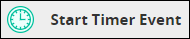
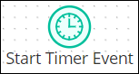
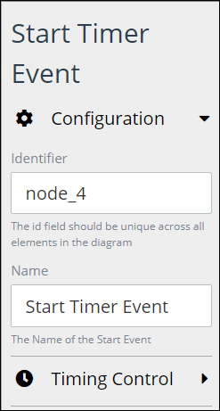
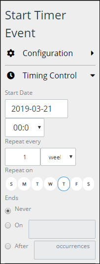

# Add and Configure Start Timer Event Elements

## Add a Start Timer Event Element


### Don't Know What a Start Timer Event Element Is?

See [Process Modeling Element Descriptions](process-modeling-element-descriptions.md) for a description of the [Start Timer Event](process-modeling-element-descriptions.md#start-timer-event) element.

### Permissions Required to Do This Task

Your user account or group membership must have the following permissions to add a Start Timer Event element to the Process model:

* Processes: View Processes
* Processes: Edit Processes

See the [Process](../../../processmaker-administration/permission-descriptions-for-users-and-groups.md#processes) permissions or ask your ProcessMaker Administrator for assistance.


Follow these steps to add a Start Timer Event element to the Process model:

1. [View your Processes](https://processmaker.gitbook.io/processmaker-4-community/-LPblkrcFWowWJ6HZdhC/~/drafts/-LRhVZm0ddxDcGGdN5ZN/primary/designing-processes/viewing-processes/view-the-list-of-processes/view-your-processes#view-all-processes). The **Processes** page displays.
2. [Create a new Process](../../viewing-processes/view-the-list-of-processes/create-a-process.md) or click the **Open Modeler** iconto edit the selected Process model. Process Modeler displays.
3. Locate the **Start Timer Event** element in the **BPMN** panel.  

   

4. Drag the element to where in the Process model you want to place it. If a Pool element is in your Process model, the Start Timer Event element cannot be placed outside of the Pool element.

After the element is placed into the Process model, you may move it by dragging it to the new location.


Moving a Start Timer Event element has the following limitations in regards to the following Process model elements:

* **Pool element:** If the Start Timer Event element is inside of a [Pool](process-modeling-element-descriptions.md#pool) element, it cannot be moved outside of the Pool element. If you attempt to do so, Process Modeler places the Start Timer Event element inside the Pool element closest to where you attempted to move it.
* **Lane element:** If the Start Timer Event element is inside of a Lane element, it can be moved to another Lane element in the same Pool element. However, the Start Timer Event element cannot be move outside of the Pool element.


## Configure a Start Timer Event Element


Your user account or group membership must have the following permissions to configure a Start Timer Event element:

* Processes: View Processes
* Processes: Edit Processes

See the [Process](../../../processmaker-administration/permission-descriptions-for-users-and-groups.md#processes) permissions or ask your ProcessMaker Administrator for assistance.


### Edit the Identifier Value

Process Modeler automatically assigns a unique value to each Process element added to a Process model. However, an element's identifier value can be changed if it is unique.


All identifier values for all elements in the Process model must be unique.


Follow these steps to edit the identifier value for a Start Timer Event element:

1. Select the Start Timer Event element from the Process model in which to edit its identifier value.
2. Expand the **Configuration** setting section if it is not presently expanded. The **Identifier** field displays. This is a required field.  

   

3. In the **Identifier** field, edit the Start Timer Event element's identifier to a unique value from all elements in the Process model and then press **Enter**. The element's identifier value is changed.

### Edit the Element Name

An element name is a human-readable reference for a Process element. Process Modeler automatically assigns the name of a Process element with its element type. However, an element's name can be changed.

Follow these steps to edit the name for a Start Timer Event element:

1. Select the Start Timer Event element from the Process model in which to edit its name.
2. Expand the **Configuration** setting section if it is not presently expanded. The **Name** field displays.  

   

3. In the **Name** field, edit the selected element's name and then press **Enter**. The element's name is changed.

## Set the Timer Controls


Your user account or group membership must have the following permissions to set the timer controls for a Start Timer Event element:

* Processes: View Processes
* Processes: Edit Processes

See the [Process](../../../processmaker-administration/permission-descriptions-for-users-and-groups.md#processes) permissions or ask your ProcessMaker Administrator for assistance.


Set the timer controls for a Start Timer Event element using the following parameters:

* Set the date and hour when the trigger the Start Timer Event element, thereby starting a [Request](../../../using-processmaker/requests/what-is-a-request.md).
* Optionally, set an interval from which to periodically trigger the Start Time Event element. This may be done in any of the following intervals:
  * Set the timer to periodically trigger on a specified number of days, weeks, months, or years.
  * Set the timer to periodically trigger on specific days of the week.
* Set when the timer control ends from any of the following options:
  * The timer never ends.
  * The timer ends on a specified date.
  * The timer ends after a number of occurrences.

Follow these steps to set the timer controls for a Start Timer Event element:

1. Select the Start Timer Event element from the Process model in which to set its timer controls.
2. Expand the **Timing Control** setting section.  

   

3. Set the date and time in which the timer initially triggers the Start Timer Event element, thereby starting a Request. Follow these guidelines:
   * From the **Start Date** field, select the date to initially trigger the Start Timer Event element. If this field has not been previously set, the current date is the default.
   * Below the **Start Date** field, set the hour of that date to initially trigger the Start Timer Event element.
4. Set at which periodical interval to trigger the Start Time Event element again, thereby starting a new Request. Follow these guidelines:
   * From the **Repeat every** setting, select at how many intervals of a set time period to trigger the Start Timer Event element. **1** is the default setting. Then select one of the following time periods for that element to trigger:
     * Day
     * Week
     * Month
     * Year
   * Alternatively, select on which days of the week in which to trigger the Start Timer Event element. Selected days display with a blue-colored background.
5. Set when to end the timer control from the following options:
   * Select **Never** to never end the timer control.
   * Select **On** to select a specific date in which to end the timer control. If this field has not been previously set, the current date is the default.
   * Select **After** and then enter how many occurrences to end the timer control after the Start Timer Event element has triggered that may times. If this field has not been previously set, **1** is the default setting.

## Related Topics









