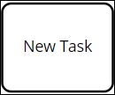

# Add and Configure Task Elements

## Add a Task Element


For a description of the [Task](../process-modeling-element-descriptions.md#user-task) element, see [Process Modeling Element Descriptions](../process-modeling-element-descriptions.md).


Follow these steps to add a Task element to the process model:

1. [View your processes](https://processmaker.gitbook.io/processmaker-4-community/-LPblkrcFWowWJ6HZdhC/~/drafts/-LRhVZm0ddxDcGGdN5ZN/primary/designing-processes/viewing-processes/view-the-list-of-processes/view-your-processes#view-all-processes). The **Processes** page displays.
2. [Create a new process](../../viewing-processes/create-a-process.md) or [select the process name of an existing process to open it](../../viewing-processes/view-the-list-of-processes/view-your-processes.md#view-all-processes). Process Modeler displays.
3. Locate the **Task** element  in the **BPMN** left side bar. Drag and drop the element to where in the process model you want to place it. The event has been added to the process model.

## Configure a Task Element

### Edit the Identifier Value

Process Modeler assigns a value to a process model or process element to identify that element. Process Modeler automatically assigns a unique value to each process element added to a process model. However, an element's identifier value can be changed as long as it is unique.


All identifier values for all elements in the process model must be unique.


Follow these steps to edit the identifier value for a Task element:

1. Place a [Task](add-and-configure-task-elements.md#add-a-task-element) element into your process model.
2. Click the Task element in which to edit its identifier value. The current Task identifier value displays in the **Identifier** field in the right side bar.
3. In the **Identifier** field, edit the selected Task element's identifier value and then press **Enter**. The identifier value is changed.

### Edit the Element Name

An element name is a human-readable reference for a process element. Process Modeler automatically assigns the name of a process element with its element type. However, an element's name can be changed.

Follow these steps to edit the name for a Task element:

1. Place a [Task](add-and-configure-task-elements.md#add-a-task-element) element into your process model.
2. Click the Task element in which to edit its name. The current name displays in the **Name** field in the right side bar.
3. In the **Name** field, edit the selected Task element's name and then press **Enter**. The element's name is changed.

### Select the ProcessMaker Screen for a Task Element


For information about ProcessMaker Screens, see [What is a Screen?](../../design-forms/what-is-a-form.md).


Since Task elements are designed to collect or display [Request](../../../using-processmaker/requests/what-is-a-request.md) information, specify which ProcessMaker Screen a selected Task element uses. A ProcessMaker Screen must already exist before it can be selected for use in a Task element.


Ensure to select a ProcessMaker Screen for each Task element in your process model. If a ProcessMaker Screen is not specified and Requests are started for that process, users who are assigned that task have no way of interacting with the Request.


Follow these steps to select a ProcessMaker Screen for a Task element:

