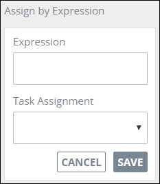
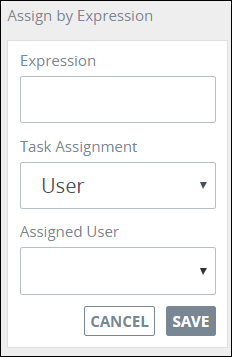
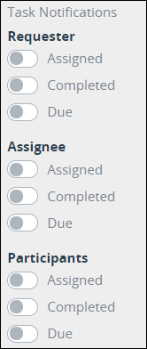

# Add and Configure Task Elements

## Add a Task Element


### Don't Know What a Task Element Is?

See [Process Modeling Element Descriptions](process-modeling-element-descriptions.md) for a description of the [Task](process-modeling-element-descriptions.md#user-task) element.

### Permissions Required to Do This Task

Your user account or group membership must have the following permissions to add a Task element to the Process model:

* Processes: View Processes
* Processes: Edit Processes

See the [Process](../../../processmaker-administration/permission-descriptions-for-users-and-groups.md#processes) permissions or ask your ProcessMaker Administrator for assistance.


Follow these steps to add a Task element to the Process model:

1. [View your Processes](https://processmaker.gitbook.io/processmaker-4-community/-LPblkrcFWowWJ6HZdhC/~/drafts/-LRhVZm0ddxDcGGdN5ZN/primary/designing-processes/viewing-processes/view-the-list-of-processes/view-your-processes#view-all-processes). The **Processes** page displays.
2. [Create a new Process](../../viewing-processes/view-the-list-of-processes/create-a-process.md) or click the **Open Modeler** iconto edit the selected Process model. Process Modeler displays.
3. Locate the **Task** element in the **BPMN** panel.

   

4. Drag the element to where in the Process model you want to place it. If a Pool element is in your Process model, the Task element cannot be placed outside of the Pool element.

After the element is placed into the Process model, you may move it by dragging it to the new location.


Moving a Task element has the following limitations in regards to the following Process model elements:

* **Pool element:** If the Task element is inside of a [Pool](process-modeling-element-descriptions.md#pool) element, it cannot be moved outside of the Pool element. If you attempt to do so, Process Modeler places the Task element inside the Pool element closest to where you attempted to move it.
* **Lane element:** If the Task element is inside of a Lane element, it can be moved to another Lane element in the same Pool element. However, the Task element cannot be move outside of the Pool element.


## Configure a Task Element


Your user account or group membership must have the following permissions to configure a Task element:

* Processes: View Processes
* Processes: Edit Processes

See the [Process](../../../processmaker-administration/permission-descriptions-for-users-and-groups.md#processes) permissions or ask your ProcessMaker Administrator for assistance.


### Edit the Identifier Value

Process Modeler automatically assigns a unique value to each Process element added to a Process model. However, an element's identifier value can be changed if it is unique.


All identifier values for all elements in the Process model must be unique.


Follow these steps to edit the identifier value for a Task element:

1. Select the Task element from the Process model in which to edit its identifier value.
2. Expand the **Configuration** setting section if it is not presently expanded. The **Identifier** field displays. This is a required field.  

   

3. In the **Identifier** field, edit the Task element's identifier to a unique value from all elements in the Process model and then press **Enter**. The element's identifier value is changed.

### Edit the Element Name

An element name is a human-readable reference for a Process element. Process Modeler automatically assigns the name of a Process element with its element type. However, an element's name can be changed.

Follow these steps to edit the name for a Task element:

1. Select the Task element from the Process model in which to edit its name.
2. Expand the **Configuration** setting section if it is not presently expanded. The **Name** field displays.  

   

3. In the **Name** field, edit the selected element's name and then press **Enter**. The element's name is changed.

### Select the ProcessMaker Screen for a Task Element


See [What is a Screen?](../../design-forms/what-is-a-form.md) for more information.


Since Task elements are designed to collect or display [Request](../../../using-processmaker/requests/what-is-a-request.md) information, specify which ProcessMaker Screen a selected Task element uses. A ProcessMaker Screen must already exist before it can be selected for use in a Task element.


Ensure to select a ProcessMaker Screen for each Task element in your Process model. If a ProcessMaker Screen is not specified and Requests are started for that Process, users who are assigned Tasks with no ProcessMaker Screens have no way of interacting with the Request.


Follow these steps to select a ProcessMaker Screen for a Task element:

1. Select the Task element from the Process model in which to specify its ProcessMaker Screen.
2. The **Screen For Input** drop-down displays below the **Configuration** settings section.  

   

3. From the **Screen For Input** drop-down, select which ProcessMaker Screen that Task element uses. Click the **Refresh** link below the **Screen For Input** drop-down if necessary to refresh the options in the drop-down.


If no ProcessMaker Screens exist, the **Screen For Input** drop-down contains no options. Ensure to select a ProcessMaker Screen for every Task element in the Process model before deploying your Process.


### Specify When the Task is Due

Specify how much time a [Task](../../../using-processmaker/task-management/what-is-a-task.md) in a Task element is due from when that task is assigned to a Request participant. The default period of time for a task to be due is 72 hours \(three days\).

The task due date displays for each [pending assigned task](../../../using-processmaker/requests/view-completed-requests.md#view-completed-requests-in-which-you-are-a-participant). After the specified time has expired for a task, an overdue indicator displays for that task to the assigned task recipient.


Specify due time for a Task element in total number of hours. This includes hours not normally associated with business hours, including overnight hours, weekends, and holidays.


Follow these steps to specify when a Task element is due:

1. Select the Task element from the Process model in which to specify how many hours the task is due.
2. The **Due In** field displays below the **Configuration** settings section.  

   

3. In the **Due In** field, specify the total number of hours the task is due in one of the following ways:
   * Enter the number in the **Due In** field and then press **Enter**. The number of hours is entered.
   * Hover your cursor over the **Due In** field, and then use the spin arrows to increase or decrease the total number of hours by one.

### Select to Whom to Assign the Task

Select to whom to assign the Task that is referenced in a Task element:

* **Requester:** Assign that Task to the Request initiator.
* **User:** Assign that Task to a selected ProcessMaker user.
* **Group:** Assign that Task to a selected ProcessMaker group. When a Task is assigned to a ProcessMaker group, round robin assignment rules determine which group member is the assignee without manually assigning the Task.
* **Previous Task assignee:** Assign that Task to who was assigned the Task in the preceding Task element.

Follow these steps to select to whom to assign the Task that is referenced in a Task element:

1. Select the Task element from the Process model in which to select the Task assignee.
2. The **Task Assignment** drop-down displays below the **Configuration** settings section.  

   

3. From the **Task Assignment** drop-down, select one of the following options:
   * **Requester:** Select **Requester** to assign the Task to the Request initiator.
   * **User:** Select **User** to assign the Task to a specified ProcessMaker user. When this option is selected, the **Assigned User** drop-down displays below the **Task Assignment** drop-down.  

     

     From the **Assigned User** drop-down, select the person's full name as the Task element's assignee.

   * **Group:** Select **Group** to assign the Task to a specified ProcessMaker group. When this option is selected, the **Assigned Group** drop-down displays below the **Task Assignment** drop-down.  

     

     From the **Assigned Group** drop-down, select the group as the Task assignee.

   * **Previous Task Assignee:** Select **Previous Task Assignee** to assign the Task to who was assigned the Task in the preceding Task element.
4. Select the **Allow Reassignment** checkbox to allow the Task assignee to reassign the Task if necessary.

### Assign the Task Using a Rule

Instead of [selecting to whom to assign a Task](add-and-configure-task-elements.md#select-to-whom-to-assign-the-task) that is reference in a Task element, assign that Task's assignee using a rule.

Select to whom to assign the Task that is referenced in a Task element using a rule:

* **Requester:** Assign that Task to the Request initiator.
* **User:** Assign that Task to a selected ProcessMaker user.
* **Group:** Assign that Task to a selected ProcessMaker group. When a Task is assigned to a ProcessMaker group, round robin assignment rules determine which group member is the assignee without manually assigning the Task.

The rule that determines the Task assignee uses an expression syntax described in [Expression Syntax Components](add-and-configure-task-elements.md#expression-syntax-components). Each rule can only have one expression, but by using logical operators multiple conditions can be specified in that expression.

Follow these steps to select to whom to assign the Task that is referenced in a Task element using a rule:

1. Select the Task element from the Process model in which to assign the Task via a rule.
2. The **Assign by Expression** option displays below the **Configuration** settings section.  

   

3. Click the **+Rule** button. The **Expression** and **Task Assignment** fields display.  

   

4. In the **Expression** field, enter or edit the expression that determines that Task element's Task assignee using the syntax components described in [Expression Syntax Components](add-and-configure-task-elements.md#expression-syntax-components), and then press **Enter**.
5. From the **Task Assignment** drop-down, select that Task's assignee from the following options:
   * **Requester:** Select the **Requester** option to assign that Task element's Task to the Request initiator if the expression in the **Expression** field evaluates as True.
   * **User:** Select the **User** option to assign that Task element's Task to a ProcessMaker user if the expression in the **Expression** field evaluates as True. When the **User** option is selected, the **Assigned User** drop-down displays below the **Task Assignment** option.  

     

     From the **Assigned User** drop-down, select which ProcessMaker user to assign that Task.

   * **Group:** Select the **Group** option to assign that Task element's Task to a ProcessMaker group if the expression in the **Expression** field evaluates as True. When the **Group** option is selected, the **Assigned Group** drop-down displays below the **Task Assignment** option.  

     

     From the **Assigned Group** drop-down, select which ProcessMaker group to assign that Task.
6. Click **Save**.

#### Expression Syntax Components

Use the following expression syntax components to compose the expression that describes to whom is assigned a Task referenced in a Task element.

**Literals**

| Component | Syntax | Example |
| :--- | :--- | :--- |
| string | `"hello world"` or `'hello world'` |  |
| number | `100` |  |
| array | `[`value1`,` value2`]` | `[1, 2]` |
| hash | `{foo: "`value`"}` | `{foo: "bar"}` |
| Boolean | `true` and `false` |  |

**Arithmetic Operations**

| Component | Syntax |
| :--- | :--- |
| addition | `+` |
| subtraction | `-` |
| multiplication | `*` |
| division | `/` |

**Logical Operators**

| Component | Syntax |
| :--- | :--- |
| not | `not` |
| and | `and` |
| or | `or` |

**Comparison Operators**

| Component | Syntax |
| :--- | :--- |
| equal to | `==` |
| not equal to | `!=` |
| less than | `<` |
| greater than | `>` |
| less than or equal to | `<=` |
| greater than or equal to | `>=` |

**String Operator**

| Component | Syntax |
| :--- | :--- |
| concatenate matches | `~` |

**Array Operators**

| Component | Syntax |
| :--- | :--- |
| contains | `in` |
| does not contain | `not in` |

**Ternary**

| Component | Syntax | Example |
| :--- | :--- | :--- |
| ternary | tested value `?` if true then value `:` else then value | `foo ? bar : baz` |

**Range**

| Component | Syntax | Example |
| :--- | :--- | :--- |
| range | `..` | `foo in 1..10` |

### Set Task Notifications

Set when [notifications](../../../using-processmaker/notifications.md) regarding Tasks are sent to the following:

* **Requester:** Send notifications to the Request initiator when the Task associated with this Task element is assigned and/or completed.
* **Task assignee:** Send notifications to Task assignees associated with this Task element when that Task is assigned and/or completed.
* **Request participants:** Send notifications to all Request participants of this Process when the Task associated with this Task element is assigned or completed.

Follow these steps to set Task notifications in a Task element:

1. Select the Task element from the Process model in which to set Task notifications.
2. The **Task Notifications** settings displays below the **Configuration** settings section.  

   

3. From the **Requester** settings, set Task notifications for the Request initiator following these guidelines:
   * Enable the **Assigned** setting to notify the Request initiator when the Task associated with this Task element is assigned. Otherwise, disable this setting to not send this notification.
   * Enable the **Completed** setting to notify the Request initiator when the Task associated with this Task element is completed. Otherwise, disable this setting to not send this notification.
4. From the **Assignee** settings, set Task notifications for assignees of this Task element following these guidelines:
   * Enable the **Assigned** setting to notify Task assignees associated with this Task element when they are assigned this Task. Otherwise, disable this setting to not send this notification.
   * Enable the **Completed** setting to notify Task assignees associated with this Task element when they complete this Task. Otherwise, disable this setting to not send this notification.
5. From the **Participants** settings, set Task notifications to all Request participants of this Process following these guidelines:
   * Enable the **Assigned** setting to notify all Request participants of this Process when the Task associated with this Task element is assigned. Otherwise, disable this setting to not send this notification.
   * Enable the **Completed** setting to notify all Request participants of this Process when the Task associated with this Task element is completed. Otherwise, disable this setting to not send this notification.

## Related Topics



















