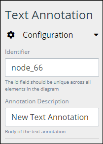
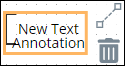
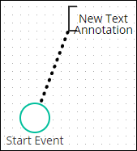
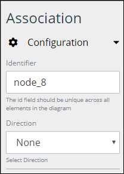
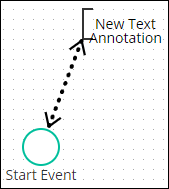

# Add and Configure Text Annotation and Association Elements

## Add a Text Annotation Element


### Don't Know What a Text Annotation Element Is?

See [Process Modeling Element Descriptions](process-modeling-element-descriptions.md) for a description of the [Text Annotation](process-modeling-element-descriptions.md#text-annotation) element.

### Permissions Required to Do This Task

Your user account or group membership must have the following permissions to add a Text Annotation element to the Process model:

* Processes: View Processes
* Processes: Edit Processes

See the [Process](../../../processmaker-administration/permission-descriptions-for-users-and-groups.md#processes) permissions or ask your ProcessMaker Administrator for assistance.


Follow these steps to add a Text Annotation element to the Process model:

1. [View your Processes](https://processmaker.gitbook.io/processmaker-4-community/-LPblkrcFWowWJ6HZdhC/~/drafts/-LRhVZm0ddxDcGGdN5ZN/primary/designing-processes/viewing-processes/view-the-list-of-processes/view-your-processes#view-all-processes). The **Processes** page displays.
2. [Create a new Process](../../viewing-processes/view-the-list-of-processes/create-a-process.md) or click the **Open Modeler** iconto edit the selected Process model. Process Modeler displays.
3. Locate the **Text Annotation** element in the **BPMN** panel.

   

4. Drag the element to where in the Process model you want to place it. If a Pool element is in your Process model, the Text Annotation element cannot be placed outside of the Pool element.

After the element is placed into the Process model, you may move it by dragging it to the new location.


Moving a Text Annotation element has the following limitations in regards to the following Process model elements:

* **Pool element:** If the Text Annotation element is inside of a [Pool](process-modeling-element-descriptions.md#pool) element, it cannot be moved outside of the Pool element. If you attempt to do so, Process Modeler places the Text Annotation element inside the Pool element closest to where you attempted to move it.
* **Lane element:** If the Text Annotation element is inside of a Lane element, it can be moved to another Lane element in the same Pool element. However, the Text Annotation element cannot be move outside of the Pool element.


## Configure a Text Annotation Element


Your user account or group membership must have the following permissions to configure a Text Annotation element:

* Processes: View Processes
* Processes: Edit Processes

See the [Process](../../../processmaker-administration/permission-descriptions-for-users-and-groups.md#processes) permissions or ask your ProcessMaker Administrator for assistance.


### Edit the Identifier Value

Process Modeler automatically assigns a unique value to each Process element added to a Process model. However, an element's identifier value can be changed if it is unique.


All identifier values for all elements in the Process model must be unique.


Follow these steps to edit the identifier value for a Text Annotation element:

1. Select the Text Annotation element from the Process model in which to edit its identifier value.
2. Expand the **Configuration** setting section if it is not presently expanded. The **Identifier** field displays. This is a required field.  

   

3. In the **Identifier** field, edit the Text Annotation element's identifier to a unique value from all elements in the Process model and then press **Enter**. The element's identifier value is changed.

### Edit the Annotation Description

Process Modeler automatically assigns a default value to a new Text Annotation element. However, change the annotation description to provide context to your Process model.

Follow these steps to edit the annotation description for a Text Annotation element:

1. Select the Text Annotation element from the Process model in which to edit its annotation description.
2. Expand the **Configuration** setting section if it is not presently expanded. The **Annotation Description** field displays.  

   

3. In the **Annotation Description** field, edit the selected element's description and then press **Enter**. The annotation description is changed.

## Add an Association Element


### Don't Know What an Association Element Is?

See [Process Modeling Element Descriptions](process-modeling-element-descriptions.md) for a description of the [Association](process-modeling-element-descriptions.md#association) element.

### Permissions Required to Do This Task

Your user account or group membership must have the following permissions to add an Association element to the Process model:

* Processes: View Processes
* Processes: Edit Processes

See the [Process](../../../processmaker-administration/permission-descriptions-for-users-and-groups.md#processes) permissions or ask your ProcessMaker Administrator for assistance.


Follow these steps to add an Association element to the Process model:

1. [View your Processes](https://processmaker.gitbook.io/processmaker-4-community/-LPblkrcFWowWJ6HZdhC/~/drafts/-LRhVZm0ddxDcGGdN5ZN/primary/designing-processes/viewing-processes/view-the-list-of-processes/view-your-processes#view-all-processes). The **Processes** page displays.
2. [Create a new Process](../../viewing-processes/view-the-list-of-processes/create-a-process.md) or click the **Open Modeler** iconto edit the selected Process model. Process Modeler displays.
3. [Add a Text Annotation element to the Process model](add-and-configure-text-annotation-elements.md#add-a-text-annotation-element).
4. Select the Text Annotation element from which you want to add an Association element. Available options display to the right of the selected element.  

   

5. Click the **Association** icon.
6. Click the Process model element in which to reference which element the Text Annotation element describes. The Annotation element is placed.  

   

## Configure an Association Element


Your user account or group membership must have the following permissions to configure an Association element:

* Processes: View Processes
* Processes: Edit Processes

See the [Process](../../../processmaker-administration/permission-descriptions-for-users-and-groups.md#processes) permissions or ask your ProcessMaker Administrator for assistance.


### Edit the Identifier Value

Process Modeler automatically assigns a unique value to each Process element added to a Process model. However, an element's identifier value can be changed if it is unique.


All identifier values for all elements in the Process model must be unique.


Follow these steps to edit the identifier value for an Association element:

1. Select the Association element from the Text Annotation element in which to edit its identifier value.
2. Expand the **Configuration** setting section if it is not presently expanded. The **Identifier** field displays. This is a required field.  

   

3. In the **Identifier** field, edit the Text Annotation element's identifier to a unique value from all elements in the Process model and then press **Enter**. The element's identifier value is changed.

### Edit the Direction of the Text Annotation Element's Reference

Use the Annotation element to place a directional arrow that points between the Text Annotation element and the element it describes.

Follow these steps to edit the directional arrow that points between the Text Annotation element and the element it describes:

1. Select the Association element from the Text Annotation element in which to edit its annotation description.
2. Expand the **Configuration** setting section if it is not presently expanded. The **Direction** drop-down displays.  

   

3. From the **Direction** drop-down, select the direction in which the arrow points between the Text Annotation element and the element it describes. Select one of the following options:
   * **None:** Select the **None** option to not display an arrow that indicates the reference between the Text Annotation element and the element it describes.  

     

   * **One:** Select the **One** option to display an arrow that points from the Text Annotation element to the element it describes. This is the default option.  

     

   * **Both:** Select the **Both** option to display arrows to and from the Text Annotation element's  referencing element.  

     

## Related Topics







