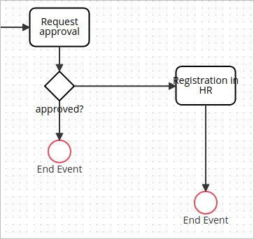

# Use an Event Element

## Event Types

The following events are supported by ProcessMaker 4:

* **Start Event:** Use this event to start the workflow of a process.
* **End Event:** Use this event to finish the flow of a process. A process can contain multiple end events.

## Adding an Event Element

Follow these steps to add an event to the process modeler:

1. [View your processes](https://processmaker.gitbook.io/processmaker-4-community/-LPblkrcFWowWJ6HZdhC/~/drafts/-LRhVZm0ddxDcGGdN5ZN/primary/designing-processes/viewing-processes/view-the-list-of-processes/view-your-processes#view-all-processes). The **Processes** page displays.
2. Click a process to open it. The process modeler displays.
3. Locate the [event](events.md#event-types) element in the BPMN left side bar. Drag and drop the element to the process modeler. The event has been added to the process modeler.

\[Image\]

## Set an Event Identifier

Follow these steps to set an event identifier:

1. [Add an event](events.md#adding-an-event-element) to the process modeler.
2. Click the new event.
3. The default event identifier displays in the context right side bar.
4. In the **Identifier** field, enter an event identifier. Process Modeler automatically saves the new value.

\[Image\]


Take into account that the process modeler can save automatically an identifier just in end events, NOT in start events.


## Set an Event Name

Follow these steps to set an event name:

1. [Add an event](events.md#adding-an-event-element) to the process modeler.
2. Click the new event.
3. The default event name displays in the context right side bar.
4. In the **Name** field, enter an event name. Process Modeler automatically saves the new value.

\[Image\]


Take into account that the process modeler can save automatically a name just in end events, NOT in start events.


