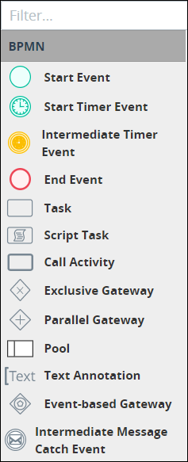

# Filter Elements in the BPMN Panel

## Filter Which BPMN Elements Display in the BPMN Panel

The **BPMN** panel in Process Modeler displays elements that can compose a process model.


See [Process Modeling Element Descriptions](process-modeling-element-descriptions.md) for more information.


Follow these steps to filter which BPMN elements display in the **BPMN** panel:

1. [View your processes](https://processmaker.gitbook.io/processmaker-4-community/-LPblkrcFWowWJ6HZdhC/~/drafts/-LRhVZm0ddxDcGGdN5ZN/primary/designing-processes/viewing-processes/view-the-list-of-processes/view-your-processes#view-all-processes). The **Processes** page displays.
2. [Create a new process](../../viewing-processes/create-a-process.md) or [select the process name of an existing process to open it](../../viewing-processes/view-the-list-of-processes/view-your-processes.md#view-all-processes). Process Modeler displays.
3. Click the **Filter** field.
4. Begin entering the name of the process model element\(s\) to display. Process model elements that do not match what you entered no longer display in the **BPMN** panel.


To display all process elements in the **BPMN** panel, remove the text from the **Filter** field.


## Related Topics







