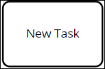
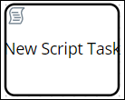
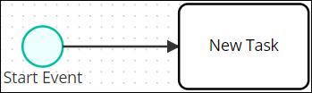

# Process Modeling Element Descriptions

The following are brief descriptions about each process modeling element. For more information, see the [BPMN specification](https://www.omg.org/spec/BPMN/2.0/About-BPMN/).

## Events

An Event represents a "milestone" in the process model.

### Start Event

A Start Event indicates where a modeled process starts. A Start Event begins the flow of a Request for that process. Therefore, a Start Event cannot have an incoming [Sequence Flow](process-modeling-element-descriptions.md#sequence-flow). A process can have multiple Start Events.

Below is a Start Event element in Process Modeler.

### End Event

An End Event indicates where a modeled process normally ends when abnormal events do not terminate a [Request](../../../using-processmaker/requests/) for that process \(such as a canceled Request\). An End Event terminates the flow of of a Request for that process. Therefore, an End Event cannot have an outgoing [Sequence Flow](process-modeling-element-descriptions.md#sequence-flow). A process can have multiple End Events.

Below is an End Event element in Process Modeler.

## Tasks

A task represents an activity to be performed either by a person or a script.

### User Task

A User Task is an activity to be performed by a person. The person assigned the perform that task might be assigned or determined by the Request routing. In Process Modeler, a User Task is labeled as "Task."

People perform User Task activities through ProcessMaker Screens as digital [forms](../../design-forms/screens-builder/types-for-screens.md#forms) and [displays](../../design-forms/screens-builder/types-for-screens.md#display). ProcessMaker Screens are designed in [Screens Builder](../../design-forms/screens-builder/). ProcessMaker Screens are independent of modeled processes: any ProcessMaker Screen can be used in any modeled process in your organization. This architecture allows Process Owners to re-use the same ProcessMaker Screen in multiple processes.

Below is a User Task element in Process Modeler.

### Script Task

A Script Task is an activity to be performed by a ProcessMaker Script.

ProcessMaker Scripts are designed in [Scripts Editor](../../scripts/scripts-editor.md). ProcessMaker Scripts are independent of modeled processes: any ProcessMaker Script can be reused in any modeled process in your organization. This architecture allows Process Owners to focus on process modeling in a no-code environment while ProcessMaker Developers develop reusable ProcessMaker Scripts. ProcessMaker Scripts can leverage Request-level variable data as well as variable data designed in ProcessMaker Screens from [Screens Builder](../../design-forms/screens-builder/).

Below is a Script Task element in Process Modeler.

## Exclusive Gateway

An Exclusive Gateway represents a decision that creates alternative paths within a [Request's](../../../using-processmaker/requests/) workflow. During a Request's workflow for that process, only one outgoing path from the Exclusive Gateway can be taken. An Exclusive Gateway can have two or more outgoing Sequence Flows.

Below is an Exclusive Gateway element in Process Modeler.

## Text Annotation

Text annotation is human-readable text in a modeled process provides description regarding the process. Text annotation performs no functional role in process Requests or routing.

Below is a Text Annotation element in Process Modeler.

## Sequence Flow

Sequence Flow represents intended workflow in a modeled process. As a best practice indicate a consistent direction of Sequence Flows, either left to right or top to bottom, to make modeled processes easier to understand.

In Process Modeler, a Sequence Flow indicator displays when you click a process element to the model. Below the arrow icon represents a Sequence Flow indicator in Process Modeler.

The Sequence Flow indicates how two process elements are connected. Below are two process elements connected in Process Modeler.


For information how to connect process elements, see [Connect and Delete Elements](the-quick-toolbar.md#connect-one-element-to-another).


## Organize Process Participants

BPMN 2.0 provides graphical representations to organize participants in a modeled process.

### Pool

A Pool represents a participant or role in a modeled process. Examples of process participants can be a specific role \("Human Resources"\), entity \(such as a company\) or a general relationship \(such as a buyer, seller, or manufacturer\). A Pool can even reference another modeled process.

Below is a Pool element in Process Modeler.

### Lane

A Lane represents a partition within a [Pool](process-modeling-element-descriptions.md#pool) element. Text within the Lane indicates the participant in the process model. Any elements within the Lane indicate that the participant is the actor or is responsible for performing activities in the process. Furthermore, [Sequence Flows](process-modeling-element-descriptions.md#sequence-flow) between elements in other Lanes indicate with which other process participants that Lane interacts.

Below is a Lane element in Process Modeler.

## Related Topics









