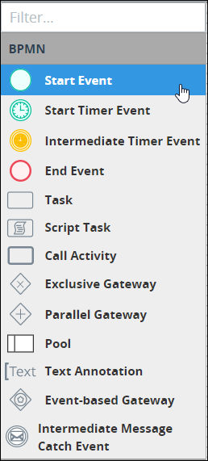
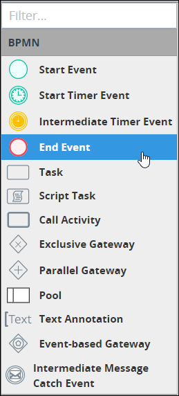

# Process Modeling Element Descriptions

## Overview

The following are brief descriptions about each Process modeling element. See the [BPMN 2.0 specification](https://www.omg.org/spec/BPMN/2.0/About-BPMN/) for more information.

## Events

An Event represents a milestone, time, or time interval in the Process model.

### Start Event

A Start Event represents where a modeled Process starts. A Start Event begins the workflow of a [Request](../../../using-processmaker/requests/what-is-a-request.md) for that Process. Therefore, a Start Event cannot have an incoming [Sequence Flow](process-modeling-element-descriptions.md#sequence-flow). A Process model can have multiple Start Events.

In Process Modeler, the Start Event element is labeled as "Start Event" in the **BPMN** panel as highlighted below.

Below is a Start Event element when it has been placed into a Process model.


See [Add and Configure Event Elements](add-and-configure-an-event-element.md#add-a-start-event-element).


### Start Timer Event

A Start Timer Event represents a time or periodic interval when a modeled Process starts. A Start Timer Event begins the workflow of a Request for that Process. Therefore, a Start Timer Event cannot have an incoming [Sequence Flow](process-modeling-element-descriptions.md#sequence-flow). A Process model can have multiple Start Timer Events.

In Process Modeler, the Start Timer Event element is labeled as "Start Timer Event" in the **BPMN** panel as highlighted below.

Below is a Start Timer Event element when it has been placed into a Process model.


See [Add and Configure Start Timer Event Elements](add-and-configure-start-timer-event-elements.md).


### Intermediate Timer Event

An Intermediate Timer Event represents a delay in a [Request's](../../../using-processmaker/requests/what-is-a-request.md) workflow for that Process either at a specific time or at a periodic interval.

In Process Modeler, the Intermediate Timer Event element is labeled as "Intermediate Timer Event" in the **BPMN** panel as highlighted below.

Below is an Intermediate Timer Event element when it has been placed into a Process model.


See [Add and Configure Intermediate Timer Event Elements](add-and-configure-intermediate-timer-event-elements.md).


### End Event

An End Event represents where a modeled Process normally ends when abnormal events do not terminate a [Request](../../../using-processmaker/requests/) for that Process \(such as a canceled Request\). An End Event terminates the workflow of a Request for that Process. Therefore, an End Event cannot have an outgoing [Sequence Flow](process-modeling-element-descriptions.md#sequence-flow). A Process model can have multiple End Events.

In Process Modeler, the End Event element is labeled as "End Event" in the **BPMN** panel as highlighted below.

Below is an End Event element when it has been placed into a Process model.


See [Add and Configure Event Elements](add-and-configure-an-event-element.md#add-an-end-event-element).


## Tasks

A task represents an activity to be performed either by a [Request](../../../using-processmaker/requests/what-is-a-request.md) participant or a [ProcessMaker Script](../../scripts/).

### Task

A Task element represents an activity to be performed by a person participating in a [Request](../../../using-processmaker/requests/what-is-a-request.md). The Request participant assigned that task might be determined by the conditions in a Request's workflow.

People perform Task activities through ProcessMaker Screens as digital [forms](../../design-forms/screens-builder/types-for-screens.md#forms) and [displays](../../design-forms/screens-builder/types-for-screens.md#display). ProcessMaker Screens are designed in [Screens Builder](../../design-forms/screens-builder/).

In Process Modeler, the Task element is labeled as "Task" in the **BPMN** panel as highlighted below.

Below is a Task element when it has been placed into a Process model.


See [Add and Configure Task Elements](add-and-configure-task-elements.md).


### Script Task

A Script Task is an activity to be performed by a ProcessMaker Script.

ProcessMaker Scripts are designed in [Scripts Editor](../../scripts/scripts-editor.md). ProcessMaker Scripts are independent of modeled processes: any ProcessMaker Script can be reused in any modeled process in your organization. This architecture allows Process Owners to focus on process modeling in a no-code environment while ProcessMaker Developers develop reusable ProcessMaker Scripts. ProcessMaker Scripts can leverage Request-level variable data as well as variable data designed in ProcessMaker Screens from [Screens Builder](../../design-forms/screens-builder/).

In Process Modeler, the Script Task element is labeled as "Script Task" in the **BPMN** panel as highlighted below.

Below is a Script Task element when it has been placed into a Process model.


See [Add and Configure Script Task Elements](add-and-configure-script-task-elements.md).


## Gateways

### Exclusive Gateway

An Exclusive Gateway represents a decision that creates alternative paths within a [Request's](../../../using-processmaker/requests/) workflow. During a Request's workflow for that Process, only one outgoing path from the Exclusive Gateway can be taken. An Exclusive Gateway can have two or more outgoing [Sequence Flows](process-modeling-element-descriptions.md#sequence-flow).

In Process Modeler, the Exclusive Gateway element is labeled as "Exclusive Gateway" in the **BPMN** panel as highlighted below.

Below is an Exclusive Gateway element when it has been placed into a Process model.


See the following topics about Exclusive Gateway elements:

* [Add and Configure Exclusive Gateway Elements](add-and-configure-exclusive-gateway-elements.md#add-an-exclusive-gateway-element)
* [Configure a Sequence Flow from an Exclusive Gateway Element](the-quick-toolbar.md#configure-a-sequence-flow-from-an-exclusive-gateway-element)


### Parallel Gateway

A Parallel Gateway represents the synchronization and/or creation of parallel paths within a [Request's](../../../using-processmaker/requests/) workflow. The Parallel Gateway element has two functions:

* A Parallel Gateway does not trigger until all its incoming [Sequence Flows](process-modeling-element-descriptions.md#sequence-flow) route to it. This is how Parallel Gateways synchronize workflow.
* When a Parallel Gateway triggers, its outgoing Sequence Flows creates parallel paths without any conditions. This function differentiates it from outgoing Sequence Flows for [Exclusive Gateway](process-modeling-element-descriptions.md#exclusive-gateway) elements.

In Process Modeler, the Parallel Gateway element is labeled as "Parallel Gateway" in the **BPMN** panel as highlighted below.

Below is a Parallel Gateway element when it has been placed into a Process model.


See [Add and Configure Parallel Gateway Elements](add-and-configure-parallel-gateway-elements.md).


## Text Annotation

Text annotation is human-readable text in a modeled process provides description regarding the process. Text annotation performs no functional role in process Requests or routing.

In Process Modeler, the Text Annotation element is labeled as "Text Annotation" in the **BPMN** panel as highlighted below.

Below is a Text Annotation element when it has been placed into a Process model.


See [Add and Configure Text Annotation Elements](add-and-configure-text-annotation-elements.md).


## Sequence Flow

Sequence Flow represents intended workflow in a modeled Process. As a best practice indicate a consistent direction of Sequence Flows, either left to right or top to bottom, to make modeled Processes easier to understand.

In Process Modeler, a Sequence Flow indicator displays when you click an element in the Process model. Below the arrow icon represents a Sequence Flow indicator in Process Modeler.


Text annotations and Pool elements do not participate in Sequence Flow.

Sequence Flows from Exclusive Gateway elements can be configured to specify under which condition a Request routes through that Sequence Flow. See [Set and Delete Sequence Flow Between Elements](the-quick-toolbar.md#configure-the-sequence-flow-for-exclusive-gateway-elements).

An End Event terminates the flow of a Request for that Process. Therefore, an End Event cannot have an outgoing Sequence Flow.


The Sequence Flow indicates how two Process elements are connected. Below are two Process elements connected in Process Modeler.


See [Connect Process Model Elements](the-quick-toolbar.md#connect-one-process-model-element-to-another).


## Organize Process Participants

BPMN 2.0 provides graphical representations to organize participants in a modeled Process.

### Pool

A Pool represents an organization or entity involved in a Process modeled. The pool might apply to a  specific role \("Human Resources"\), entity \(such as a company\) or a general relationship \(such as a buyer, seller, or manufacturer\). A Pool can even reference another modeled Process.

In Process Modeler, the Pool element is labeled as "Pool" in the **BPMN** panel as highlighted below.

Below is a Pool element when it has been placed into a Process model.


See [Add and Configure Pool and Lane Elements](add-and-configure-pool-and-lane-elements.md).


### Lane

A Lane represents a partition within a [Pool](process-modeling-element-descriptions.md#pool) element. Each Lane indicates individual roles and/or participants that perform tasks within the Pool. Text within the Lane indicates the participant in the Process model. Any elements within the Lane indicate that the participant is the actor or is responsible for performing tasks in the Process. Furthermore, [Sequence Flows](process-modeling-element-descriptions.md#sequence-flow) between elements in other Pools or  Lanes indicate with which other Process participants that Lane interacts.

Below is a Pool element with three Lane elements when it has been placed into a Process model. Each lane indicates roles within the overall organization.


See [Add and Configure Pool and Lane Elements](add-and-configure-pool-and-lane-elements.md).


## Related Topics









