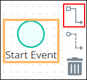

# Remove Process Model Elements

## Remove a Process Model Element

Removing a process model element also removes any Sequence Flows incoming to or outgoing from that element. Therefore, if a process element is removed that has both incoming and outgoing Sequence Flows, the disconnected Sequence Flows must be reconnected for the remaining elements.


For a description of the [Sequence Flow](process-modeling-element-descriptions.md#sequence-flow), see [Process Modeling Element Descriptions](process-modeling-element-descriptions.md).


Follow these steps to remove a process model element:

1. ​[View your processes](../../viewing-processes/view-the-list-of-processes/view-your-processes.md#view-all-processes). The **Processes** page displays.
2. [Create a new process](../../viewing-processes/create-a-process.md) or [select the process name of an existing process to open it](../../viewing-processes/view-the-list-of-processes/view-your-processes.md#view-all-processes). Process Modeler displays.
3. Select the process model element to remove. Available options display to the right of the selected element.  

   

4. Click the **Trash** icon. The process model element is removed.

## Related Topics







