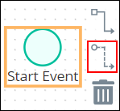
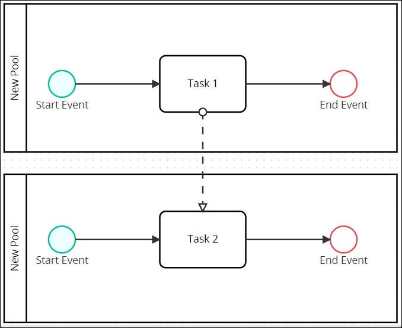

# Set Message Flow Elements Between Separate Pool Elements

## Overview

In a Process model, Message Flow elements represent communication between an element in one Pool element with another element in a separate Pool element. Message Flow elements are not to be confused with [Sequence Flow](process-modeling-element-descriptions.md#sequence-flow) elements.

In Process Modeler, Flow indicators display when you click an element in the Process model. The bottom Flow indicator is for Message Flows, represented with a dotted line \(highlighted below\).

The Message Flow element indicates communication between the two separate Pool elements. The Message Flow does not indicate whether the communication is physical or digital. Use a [Text Annotation](process-modeling-element-descriptions.md#text-annotation) element to add information about the communication.

Message Flow elements cannot connect to Process model elements within the same Pool element.

The following element types do not use Message Flow elements:

* ​Start Timer Event
* Intermediate Timer Event
* Script Task
* Exclusive Gateway
* Parallel Gateway
* Text Annotation

## Set the Message Flow Element Between Elements in Separate Pool Elements


### Looking for Information about Sequence Flow Elements?

See [Set and Delete Sequence Flow Between Elements](the-quick-toolbar.md).

### Permissions Required to Do This Task

Your user account or group membership must have the following permissions to set Message Flow elements in the Process model:

* Processes: View Processes
* Processes: Edit Processes

See the [Process](../../../processmaker-administration/permission-descriptions-for-users-and-groups.md#processes) permissions or ask your ProcessMaker Administrator for assistance.


Follow these steps to set the Message Flow element between elements in separate Pool elements:

1. ​[View your Processes](../../viewing-processes/view-the-list-of-processes/view-your-processes.md#view-all-processes). The **Processes** page displays.
2. Click the **Open Modeler** iconto edit the selected Process model. Process Modeler displays. Ensure that the Process model has at least two \(2\) Pool elements from which to establish Message Flow between them.
3. From one Pool element, select the Process model element from which you want to establish communication the Message Flow element. Available options display to the right of the selected element. Process model element types that do not support the Message Flow element do not have the Message Flow icon as highlighted below.  

   

4. Click the **Message Flow** icon.
5. Do one of the following:
   * Click the second Pool element to which to establish communication between the two elements. Message flow indicates that communication is between an element in one Pool element to another Pool elements.  

     

   * Click an element inside the second Pool element to which to establish communication between the two elements. Message flow indicates that communication is between two elements in separate Pool elements.  

     

## Configure a Message Flow Element


Your user account or group membership must have the following permissions to configure a Message Flow element:

* Processes: View Processes
* Processes: Edit Processes

See the [Process](../../../processmaker-administration/permission-descriptions-for-users-and-groups.md#processes) permissions or ask your ProcessMaker Administrator for assistance.


### Edit the Identifier Value

Process Modeler automatically assigns a unique value to each Process element added to a Process model. However, an element's identifier value can be changed if it is unique.


All identifier values for all elements in the Process model must be unique.


Follow these steps to edit the identifier value for a Message Flow element:

1. Select the Message Flow element from the Process model in which to edit its identifier value.
2. Expand the **Configuration** setting section if it is not presently expanded. The **Identifier** field displays. This is a required field.  

   

3. In the **Identifier** field, edit the Message Flow element's identifier to a unique value from all elements in the Process model and then press **Enter**. The element's identifier value is changed.

### Edit the Element Name

An element name is a human-readable reference for a Process element. Process Modeler automatically assigns the name of a Process element with its element type. However, an element's name can be changed.

Follow these steps to edit the name for a Message Flow element:

1. Select the Message Flow element from the Process model in which to edit its name.
2. Expand the **Configuration** setting section if it is not presently expanded. The **Name** field displays.  

   

3. In the **Name** field, edit the selected element's name and then press **Enter**. The element's name is changed.

## Related Topics









