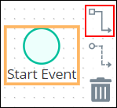

# Set and Delete Sequence Flow Between Elements

## Overview

Connecting a Process model element to another sets the Sequence Flow between the connected elements. The direction in which the Sequence Flow points implies how [Request](../../../using-processmaker/requests/what-is-a-request.md) data is conveyed and utilized in the Process model. As a best practice indicate a consistent direction of Sequence Flows, either left to right or top to bottom, to make modeled Processes easier to understand.

Sequence Flows have the following attributes in regards to specific Process model elements:

* Text annotations and Pool elements do not participate in Sequence Flow.
* Sequence Flows cannot be established between Process model elements within different Pool elements.
* A Start Event begins the flow of a Request for that Process. Therefore, a Start Event cannot have an incoming Sequence Flow.
* An End Event terminates the flow of a Request for that Process. Therefore, an End Event cannot have an outgoing Sequence Flow.
* Sequence Flows from Exclusive Gateway elements can be configured to specify under which condition a Request routes through that Sequence Flow. See [Configure a Sequence Flow from an Exclusive Gateway Element](the-quick-toolbar.md#configure-a-sequence-flow-from-an-exclusive-gateway-element).

## Set the Sequence Flow from One Element to Another


Your user account or group membership must have the following permissions to set Sequence Flow in the Process model:

* Processes: View Processes
* Processes: Edit Processes

Ask your ProcessMaker Administrator for assistance if necessary.


Follow these steps to set the Sequence Flow from one element to another:

1. ​[View your Processes](../../viewing-processes/view-the-list-of-processes/view-your-processes.md#view-all-processes). The **Processes** page displays.
2. Click the **Open Modeler** iconto edit the selected Process model. Process Modeler displays.
3. Select the Process model element from which you want to set the Sequence Flow. Available options display to the right of the selected element.  

   

4. Click the **Sequence Flow** icon.
5. Click the Process model element in which to set the Sequence Flow. The Sequence Flow between the elements is established.  

   

## Configure Sequence Flow Elements


Your user account or group membership must have the following permissions to configure Sequence Flows in the Process model:

* Processes: View Processes
* Processes: Edit Processes

Ask your ProcessMaker Administrator for assistance if necessary.


### Configure a Sequence Flow Element


This section discusses how to configure any Sequence Flow element except from an Exclusive Gateway element. See [Configure a Sequence Flow from an Exclusive Gateway Element](the-quick-toolbar.md#configure-a-sequence-flow-from-an-exclusive-gateway-element) if looking for information to configure those Sequence Flows.


#### Edit the Identifier Value

Process Modeler automatically assigns a unique value to each Process element added to a Process model. However, an element's identifier value can be changed as long as it is unique.


All identifier values for all elements in the Process model must be unique.


Follow these steps to edit the identifier value for a Sequence Flow element:

1. Select the Sequence Flow element in which to edit its identifier value. The current Sequence Flow identifier value displays in the **Identifier** field in the right side bar.
2. In the **Identifier** field, edit the selected Sequence Flow element's identifier value and then press **Enter**. The identifier value is changed.

#### Edit the Element Name

An element name is a human-readable reference for a Process element. Process Modeler automatically assigns the name of a Process element with its element type. However, an element's name can be changed.

Follow these steps to edit the name for a Sequence Flow element:

1. Select the Sequence Flow element in which to edit its name. The current name displays in the **Name** field in the right side bar.
2. In the **Name** field, edit the selected Sequence Flow element's name and then press **Enter**. The element's name is changed.

### Configure a Sequence Flow from an Exclusive Gateway Element

Sequence Flows from Exclusive Gateway elements have the following settings as for Sequence Flows not associated with Exclusive Gateway elements:

* [Identifier value](the-quick-toolbar.md#edit-the-identifier-value)
* [Element name](the-quick-toolbar.md#edit-the-element-name)

Sequence Flows from Exclusive Gateway elements have an addition setting to indicate the condition under which a Request should follow that Sequence Flow to its connected element. Only one condition can be specified in a Sequence Flow. Specify this condition using an expression syntax described in [Expression Syntax Components](the-quick-toolbar.md#expression-syntax-components).

Follow these steps to set the condition under which a Request follows a Sequence Flow element:

1. Select the Sequence Flow from the Exclusive Gateway element in which to set its workflow condition. The expression syntax displays in the **Expression** field in the right side bar if one has been set previously.
2. In the **Expression** field, enter or edit the expression syntax for the selected Sequence Flow element using the syntax components described in [Expression Syntax Components](the-quick-toolbar.md#expression-syntax-components), and then press **Enter**.

#### Expression Syntax Components

Use the following expression syntax components to compose the expression that describes under which condition a Request follows that Sequence Flow to its connected element.

**Literals**

| Component | Syntax | Example |
| :--- | :--- | :--- |
| string | `"hello world"` or `'hello world'` |  |
| number | `100` |  |
| array | `[`value1`,` value2`]` | `[1, 2]` |
| hash | `{foo: "`value`"}` | `{foo: "bar"}` |
| Boolean | `true` and `false` |  |

**Arithmetic Operations**

| Component | Syntax |
| :--- | :--- |
| addition | `+` |
| subtraction | `-` |
| multiplication | `*` |
| division | `/` |

**Logical Operators**

| Component | Syntax |
| :--- | :--- |
| not | `not` |
| and | `and` |
| or | `or` |

**Comparison Operators**

| Component | Syntax |
| :--- | :--- |
| equal to | `==` |
| not equal to | `!=` |
| less than | `<` |
| greater than | `>` |
| less than or equal to | `<=` |
| greater than or equal to | `>=` |

**String Operator**

| Component | Syntax |
| :--- | :--- |
| concatenate matches | `~` |

**Array Operators**

| Component | Syntax |
| :--- | :--- |
| contains | `in` |
| does not contain | `not in` |

**Ternary**

| Component | Syntax | Example |
| :--- | :--- | :--- |
| ternary | tested value `?` if true then value `:` else then value | `foo ? bar : baz` |

**Range**

| Component | Syntax | Example |
| :--- | :--- | :--- |
| range | `..` | `foo in 1..10` |

## Delete the Sequence Flow Between Two Elements


Your user account or group membership must have the following permissions to delete the Sequence Flow between two elements in the Process model:

* Processes: View Processes
* Processes: Edit Processes

Ask your ProcessMaker Administrator for assistance if necessary.


Follow these steps to delete the Sequence Flow between two elements:

1. Select the Sequence Flow to be deleted between two elements.  

   

2. Click the **Delete** icon. The Sequence Flow between the two elements is deleted.

## Related Topics







