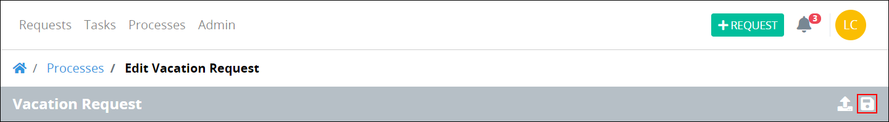

# Save Your Process Model

## Save Your Process Model

Process Modeler displays the **Save** iconon the same bar as the process name.

Follow these steps to save your process model:

1. ​[View your processes](https://processmaker.gitbook.io/processmaker-4-community/-LPblkrcFWowWJ6HZdhC/~/drafts/-LRhVZm0ddxDcGGdN5ZN/primary/designing-processes/viewing-processes/view-the-list-of-processes/view-your-processes#view-all-processes). The **Processes** page displays.
2. [Create a new process](../../viewing-processes/create-a-process.md) or [select the process name of an existing process to open it](../../viewing-processes/view-the-list-of-processes/view-your-processes.md#view-all-processes). Process Modeler displays.
3. Make changes in the process model.
4. Click the **Save** icon. The process model is saved.

## Related Topics





