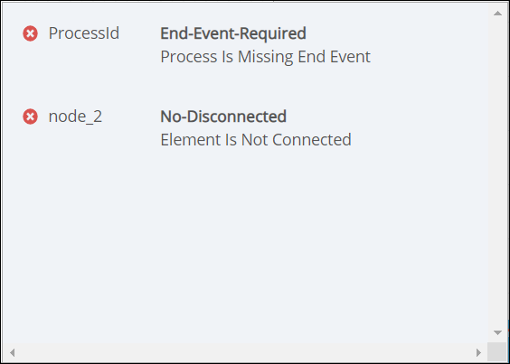

# Validate Your Process is BPMN 2.0 Compliant

## Overview

Before you deploy your Process model to production, ensure that it is BPMN 2.0 compliant. Ensure that your Process model is valid for the following reasons:

* Minimize problems when testing your Process prior to deploying it. Regardless of whether your Process model is a self-contained business solution or one which calls another Process/is called by another Process, ensure that it functions correctly by validating its BPMN 2.0 compliance.
* Ensure that if you [export](../../viewing-processes/view-the-list-of-processes/export-a-bpmn-compliant-process.md) the Process, you will be able to [import](../../viewing-processes/view-the-list-of-processes/import-a-bpmn-compliant-process.md) it later. If the Process model is not BPMN 2.0 compliant, you will not successfully import the Process.
* If you share your Process model with either the open-source community or with other teams in your organization, ensure that the Process model is BPMN 2.0 compliant so that it is useful to others.

## Validate Your Process Is BPMN 2.0 Compliant


Your user account or group membership must have the following permissions to validate the Process model is BPMN 2.0 compliant:

* Processes: View Processes
* Processes: Edit Processes

See the [Process](../../../processmaker-administration/permission-descriptions-for-users-and-groups.md#processes) permissions or ask your ProcessMaker Administrator for assistance.


Follow these steps to validate your Process model is BPMN 2.0 compliant:

1. ​[View your Processes](https://processmaker.gitbook.io/processmaker-4-community/-LPblkrcFWowWJ6HZdhC/~/drafts/-LRhVZm0ddxDcGGdN5ZN/primary/designing-processes/viewing-processes/view-the-list-of-processes/view-your-processes#view-all-processes). The **Processes** page displays.
2. ​[Create a new Process](https://processmaker.gitbook.io/processmaker-4-community/-LPblkrcFWowWJ6HZdhC/~/edit/drafts/-LauIZVG_nBSIczT8ilV/designing-processes/viewing-processes/view-the-list-of-processes/create-a-process) or click the **Open Modeler** icon​to edit the selected Process model. Process Modeler displays. Until you test the validity of your Process model, ProcessMaker 4 indicates that there are no problems by displaying the green check mark.  

   

3. [Save your Process model](toolboxes.md#save-your-process-model) if you make changes.
4. Click the **Validate BPMN** button. ProcessMaker 4 tests the Process model's BPMN 2.0 compliance. One of the following occurs:
   * **No errors found:** If no errors are found, the following text displays to the left of the **Validate BPMN** button: **Problems 0**. The green check mark displays. Your Process model is BPMN 2.0 compliant.
   * **Errors are found:** If errors are found, ProcessMaker 4 displays how any errors are found to the left of the **Validate BPMN** button. Instead of the green check mark the error icon displays. Click the error icon to display a summary of the errors. Below is an example.  

     
5. fdfdf

## Related Topics





