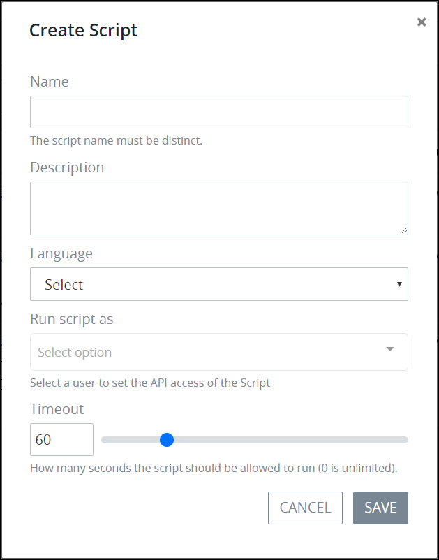

# Create a New Script


To create a new ProcessMaker Script, you must be a member of the Process Owner group. Otherwise, the **Processes** option is not available from the top menu that allows you to perform Script management activities.


## Create a New ProcessMaker Script

Follow these steps to create a new ProcessMaker Script:

1. [View your ProcessMaker Scripts](manage-scripts/view-all-scripts.md). The **Scripts** page displays.
2. Click the **+SCRIPT** button. The **Add a Script** page displays.  

   

3. Enter the name of the ProcessMaker Script in the **Title** field. ~~Character length limitation and/or unsupported characters?~~ This is a required field.
4. Enter a description for the ProcessMaker Script in the **Description** field. ~~This does not seem to be a required field. Character length limitation and/or unsupported characters?~~
5. Select one of the following programming languages from the **Language** drop-down to specify with which the ProcessMaker Script is written:
   * PHP
   * Lua
6. Click **Save**. Scripts Editor displays. For information how to develop and test your ProcessMaker Script, see [Scripts Editor](scripts-editor.md).

## Related Topics















