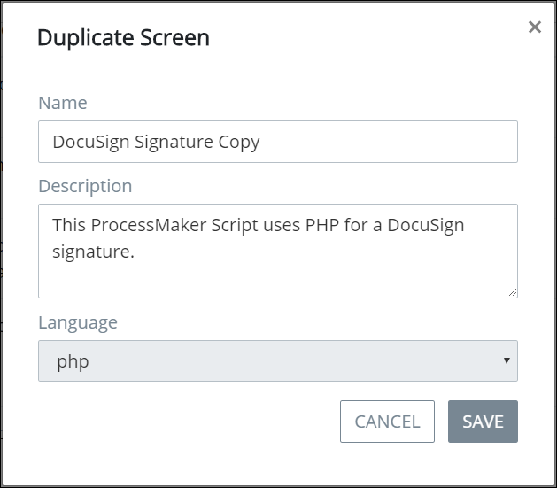

# Duplicate a Script

## Duplicate a ProcessMaker Script


Your user account or group membership must have the following permissions to duplicate a ProcessMaker Script:

* Scripts: View Scripts
* Scripts: Edit Scripts

See the ProcessMaker [Scripts](../../../processmaker-administration/permission-descriptions-for-users-and-groups.md#scripts) permissions or ask your ProcessMaker Administrator for assistance.


Follow these steps to duplicate a ProcessMaker Script:

1. [View your ProcessMaker Scripts](view-all-scripts.md). The **Scripts** page displays.
2. Select the **Duplicate** iconfor your ProcessMaker Script. The **Duplicate Screen** screen displays.  

   

3. Edit the following information from the original ProcessMaker Script as necessary:
   * In the **Name** field, edit the name of the duplicated ProcessMaker Script. After the original ProcessMaker Script is duplicated, the word **Copy** is suffixed to the original Script's name. This is a required field.
   * In the **Description** field, edit the description from the original ProcessMaker Script.
4. Click **Save**.


The **Language** field shows in which programming language the original ProcessMaker Script is written. The duplicate ProcessMaker Script must be in the same programming language.


## Related Topics

















