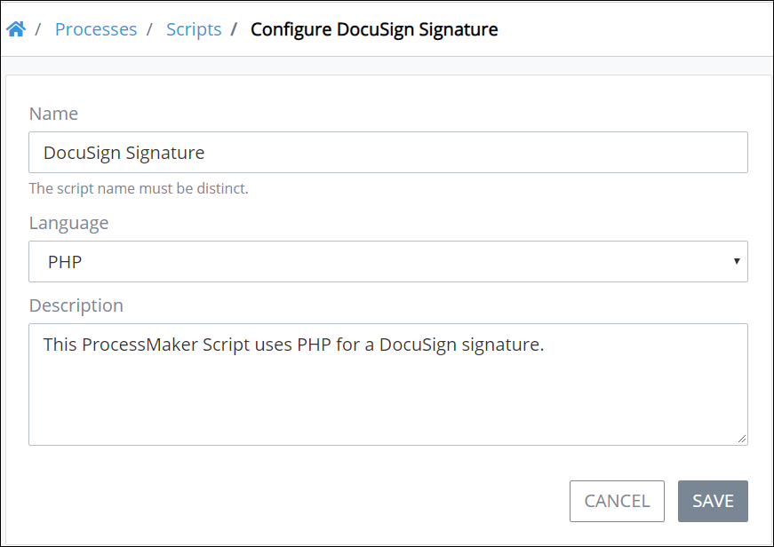

# Configure a Script

## Configure a ProcessMaker Script


Your user account or group membership must have the following permissions to configure a ProcessMaker Script's configuration:

* Scripts: View Scripts
* Scripts: Edit Scripts

See the ProcessMaker [Scripts](../../../processmaker-administration/permission-descriptions-for-users-and-groups.md#scripts) permissions or ask your ProcessMaker Administrator for assistance.


Follow these steps to configure a ProcessMaker Script:

1. [View your ProcessMaker Scripts.](view-all-scripts.md#view-all-processmaker-scripts) The **Scripts** page displays.
2. Select the **Configure** iconfor your ProcessMaker Script. The **Edit** page displays.  

   

3. Edit the following information about the ProcessMaker Script as necessary:
   * In the **Name** field, edit the ProcessMaker Script name. This is a required field.
   * From the **Language** drop-down menu, select one of the following programming languages in which the ProcessMaker Script is written:

     * PHP
     * Lua

     This is a required field.

   * In the **Description** field, edit the description of the ProcessMaker Script. This is a required field.
4. Click **Save**.

## Related Topics

















