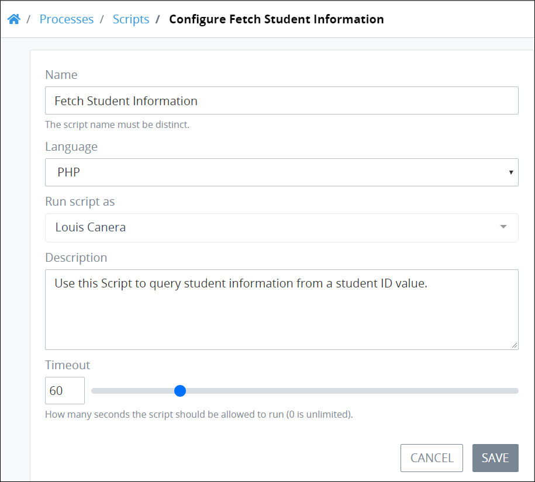

# Edit Script Configuration

## Edit Configuration Information About a ProcessMaker Script


Your user account or group membership must have the following permissions to edit a ProcessMaker Script's configuration:

* Scripts: View Scripts
* Scripts: Edit Scripts

Ask your ProcessMaker Administrator for assistance.


Follow these steps to edit the configuration information about a ProcessMaker Script:

1. [View your ProcessMaker Scripts.](view-all-scripts.md#view-all-processmaker-scripts) The **Scripts** page displays.
2. Select the **Config** iconfor your ProcessMaker Script. The **Edit Script** page displays.  

   

3. Edit the following information about the ProcessMaker Script as necessary:
   * In the **Name** field, edit the ProcessMaker Script name. This is a required field.
   * From the **Language** drop-down, select one of the following programming languages to specify with which the ProcessMaker Script is written:
     * PHP
     * Lua
   * In the **Description** field, edit the description of the ProcessMaker Script. This is a required field.
4. Click **Update**. Otherwise, click **Cancel** to cancel any changes.

## Related Topics















