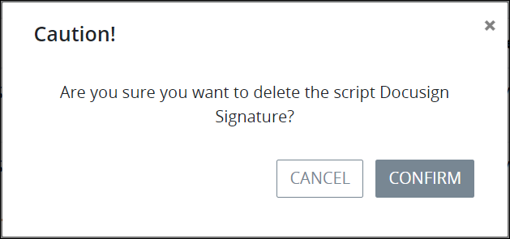

# Remove a Script


To remove a ProcessMaker Script, you must be a member of the Process Owner group. Otherwise, the **Processes** option is not available from the top menu that allows you to perform Script management activities.


## Remove a ProcessMaker Script


When a ProcessMaker Script is removed ~~describe what happens and in which conditions a process can be removed.~~

Removing a ProcessMaker Script from the **Scripts** page cannot be undone.


Follow these steps to remove a ProcessMaker Script:

1. [View your ProcessMaker Scripts](view-all-scripts.md). The **Scripts** page displays.
2. Hover your cursor over the ProcessMaker Script to remove and then click the **Remove** icon. The **Caution** screen displays to confirm the removal of the ProcessMaker Script.  

   

3. Click **Confirm** to remove the ProcessMaker Script. Otherwise, click **Cancel** to not remove the ProcessMaker Script.

## Related Topics















