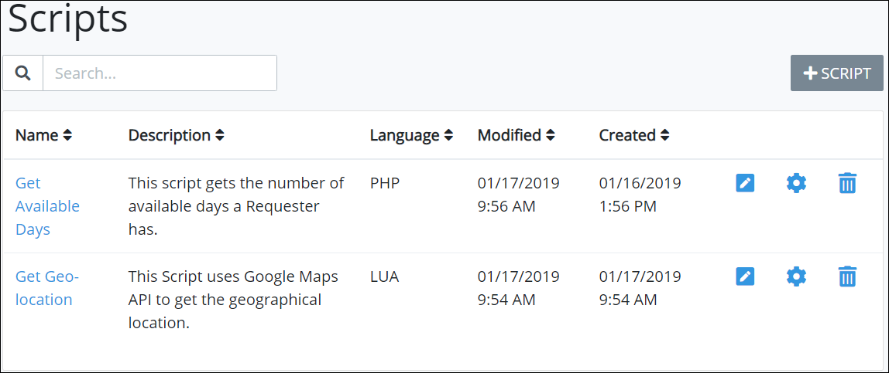

# View All Scripts

ProcessMaker displays all ProcessMaker Scripts in one table that Process Owners throughout your organization have created. Any ProcessMaker Script developed by any Process Owner or ProcessMaker Developer can be used in any process in your organization. This makes it easy to manage ProcessMaker Scripts.


To view ProcessMaker Scripts, you must be a member of the Process Owner group. Otherwise, the **Processes** option is not available from the top menu that allows you to perform Script management activities.


## View All ProcessMaker Scripts

Follow these steps to view all ProcessMaker Scripts in your organization:

1. [Log in](../../../using-processmaker/log-in.md#log-in) to ProcessMaker.
2. Click the **Processes** option from the top menu. The **Processes** page displays.
3. Click the **Scripts** icon. The **Scripts** page displays all ProcessMaker Scripts created by all Process Owners and ProcessMaker Developers in your organization.

The **Scripts** page displays the following information about ProcessMaker Scripts:

* **Title:** The **Title** column displays the name of the ProcessMaker Script.
* **Language:** The **Language** column displays the programming language with which the ProcessMaker Script was written. Lua and PHP languages are supported out-of-the-box.
* **Modified:** The **Modified** column displays the date and time the ProcessMaker Script was last modified.
* **Created:** The **Created** column displays the date and time the ProcessMaker Script was created.


For information how to search for a ProcessMaker Script, see [Search for a Script](search-for-a-script.md).



For information how to edit a ProcessMaker Script, see [Edit a Script](edit-a-script.md).



If no ProcessMaker Scripts exist, the following message displays: ~~**You don't have any scripts. Please click on '+SCRIPT' to get started**~~**.**



[Control how tabular information displays.](../../../using-processmaker/control-how-requests-display-in-a-tab.md)


## Related Topics



















