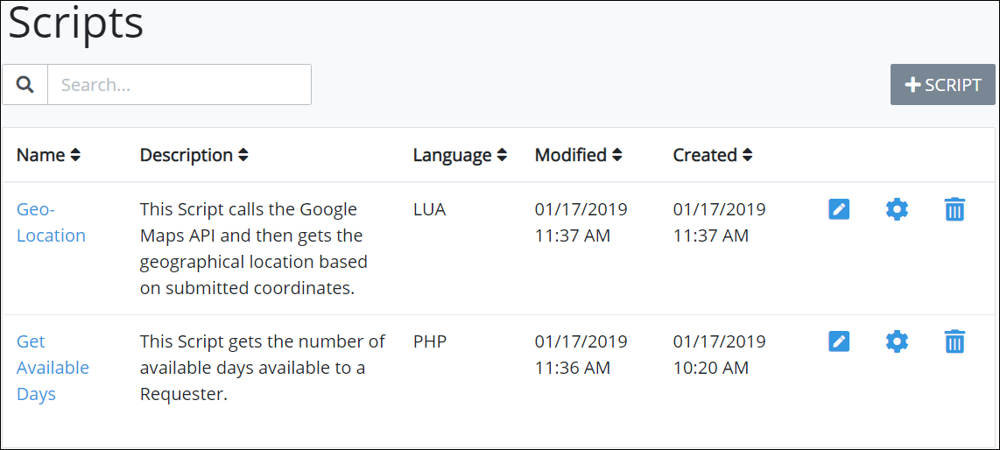

# View All Scripts

ProcessMaker displays all ProcessMaker Scripts in one location. Any ProcessMaker Script developed by any Process Owner or ProcessMaker Developer can be used in any Process model. This makes it easy to manage ProcessMaker Scripts.

## View All ProcessMaker Scripts


Your user account or group membership must have the "Scripts: View Scripts" permission to view the list of ProcessMaker Scripts.

Ask your ProcessMaker Administrator for assistance.


Follow these steps to view all ProcessMaker Scripts in your organization:

1. [Log in](../../../using-processmaker/log-in.md#log-in) to ProcessMaker.
2. Click the **Processes** option from the top menu. The **Processes** page displays.
3. Click the **Scripts** icon from the left sidebar. The **Scripts** page displays all ProcessMaker Scripts.

The **Scripts** page displays the following information about ProcessMaker Scripts:

* **Name:** The **Name** column displays the name of the ProcessMaker Script.
* Description: The Description column displays the description of the ProcessMaker Script.
* **Language:** The **Language** column displays the programming language with which the ProcessMaker Script was written. Lua and PHP languages are supported out-of-the-box.
* **Modified:** The **Modified** column displays the date and time the ProcessMaker Script was last modified. The time zone setting to display the time is according to the ProcessMaker 4 server unless your [user profile's](../../../using-processmaker/profile-settings.md#change-your-profile-settings) **Time zone** setting is specified.
* **Created:** The **Created** column displays the date and time the ProcessMaker Script was created. The time zone setting to display the time is according to the ProcessMaker 4 server unless your [user profile's](../../../using-processmaker/profile-settings.md#change-your-profile-settings) **Time zone** setting is specified.


### Search for a ProcessMaker Script

Use the [Search](search-for-a-script.md#search-for-a-processmaker-script) field to filter ProcessMaker Scripts that display.

### No ProcessMaker Scripts?

If no ProcessMaker Scripts exist, the following message displays: 

~~**You don't have any scripts. Please click on '+SCRIPT' to get started**~~.

### Edit a ProcessMaker Script

For information how to edit a ProcessMaker Script, see [Edit a Script](edit-a-script.md).

### Display Information the Way You Want It

[Control how tabular information displays](../../../using-processmaker/control-how-requests-display-in-a-tab.md), including how to sort columns or how many items display per page.


## Related Topics















