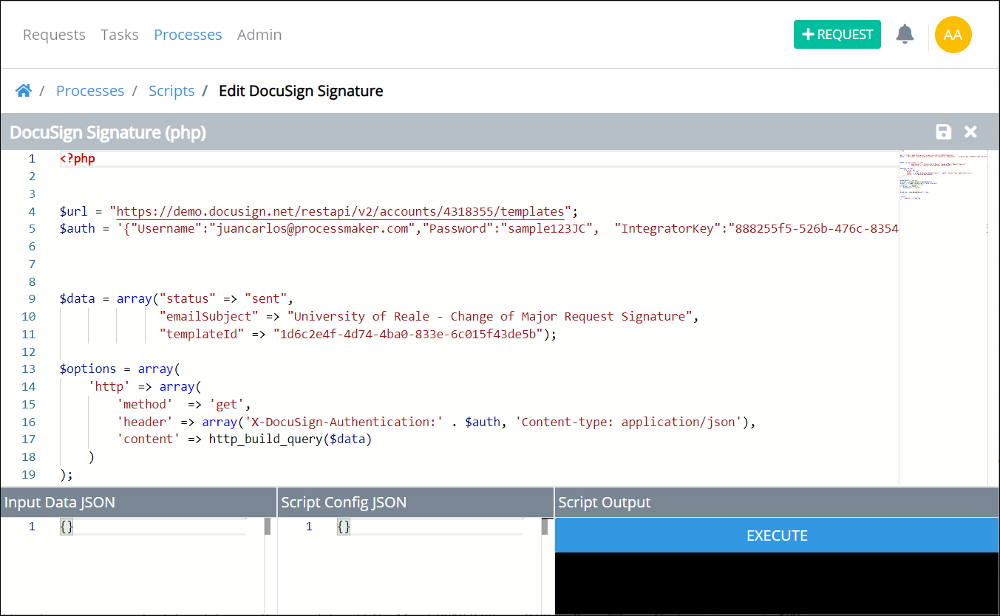

# Scripts Editor


To use Scripts Editor, you must be a member of the Process Owner group. Otherwise, the **Processes** option is not available from the top menu that allows you to develop and test ProcessMaker Scripts.


## Overview

Use Scripts Editor to develop and test your ProcessMaker Scripts. Any ProcessMaker Script can be used in any process in your organization. Scripts Editor supports Lua and PHP languages out-of-the-box.

Scripts Editor evaluates a ProcessMaker Script securely and in isolation. This ensures that any malicious script that anyone in your organization might introduce to ProcessMaker does not affect the ProcessMaker application or its environment.

ProcessMaker Scripts are developed and tested in the same environment.


Access Scripts Editor in the following ways:

* [Create a new ProcessMaker Script.](create-a-new-script.md#create-a-new-processmaker-script)
* [Edit an existing ProcessMaker Script.](manage-scripts/edit-a-script.md#edit-a-processmaker-script)


Below is Scripts Editor displaying a ProcessMaker Script written in Lua.


ProcessMaker offers many open-source Lua scripts that function as-is with many third-party services. Use any of them for your own ProcessMaker Scripts. [View them here.](https://github.com/ProcessMaker/pmio-lua-connectors)


## Guidelines to Use Scripts Editor

Follow these guidelines to develop and test ProcessMaker Scripts in Scripts Editor.

### Develop Your ProcessMaker Script

Develop the ProcessMaker Script below the script's name and language. Use the scroll panel to the right of the ProcessMaker script to scroll to different sections of the script. This is useful especially when you are editing a long ProcessMaker Script.

### Enter JSON Data Model Variables as Input to Your ProcessMaker Script

Use the **Input Data JSON** panel to include the JSON data model variables from ProcessMaker Screens.


ProcessMaker Screens are independent of any business process. They can be used in any process in your organization. Furthermore, variables used in processes are defined in the ProcessMaker Screens those processes use. You can use ProcessMaker Screens that other Process Owners designed in your business process.

Define the variables in a ProcessMaker Screen in the **Inspector** panel when you configure controls in that Screen. For information how to view the **Inspector** panel, see [View the Inspector Panel](../design-forms/screens-builder/view-the-inspector-pane.md). For information about each control's Inspector settings, see [information about each control](../design-forms/screens-builder/control-descriptions/).


Follow these guidelines to use the JSON data model variables from a ProcessMaker Screen as input to your ProcessMaker Script:

1. [Open the ProcessMaker Screen](../design-forms/manage-forms/edit-a-screen.md) in which to view its JSON data model.
2. Enter Preview mode on the ProcessMaker Screen page to view its JSON data model. Click the **Preview** option from Screen Builder's top menu to be in Preview mode.
3. Enter values into the control fields as if you were using the ProcessMaker Screen in a Request. In the **Data Preview** panel to the right of the ProcessMaker Screen, the JSON data model displays the key-value pairs. The key's values are those you enter in the ProcessMaker Screen preview. Understand what the key names are. You may use these key names as variables in your ProcessMaker Script.

   The JSON data model within a ProcessMaker Screen becomes the variables used in any process that uses that Screen. You can use these variables to capture what Request participants enter into a Screen and use this data in a ProcessMaker Script.

4. After you have entered values into the ProcessMaker Script in Preview mode, the entire JSON data model displays in the **Data Preview** panel. Copy the JSON data model.
5. Paste the JSON data model into the **Input Data JSON** panel in Scripts Editor. If you use any variables as defined in the JSON data model in your ProcessMaker Script, Scripts Editor uses those variable values during script testing.

### Enter Other JSON Data as Input to Your ProcessMaker Script

Use the **Script Config JSON** panel to include JSON configuration settings your ProcessMaker Script might access. For example, include the Client ID and Client Secret values in JSON format for OAuth 2.0 verification to a third-party service's API your ProcessMaker Script must access to get information. By entering these values into the **Script Config JSON** panel, you can verify during testing that these values are valid to the third-party service.

### Test Your ProcessMaker Script

Click the **Execute** button to test your ProcessMaker Script. Scripts Editor evaluates any JSON data entered into the **Input Data JSON** and **Script Config JSON** panels.

If the ProcessMaker Script evaluates successfully, its output displays below the **Execute** button. If the ProcessMaker Script does not evaluate successfully, the language engine that evaluated the script displays an error.

### Save Your ProcessMaker Script

Click the **Save** icon  from Script Editor's top menu to save the ProcessMaker Script.

### Close Scripts Editor

Click the **Close** icon  from Script Editor's top menu to close Scripts Editor and return to the **Scripts** page.

## Scripts Editor Best Practices

Follow these best practices when developing ProcessMaker Scripts.

## Related Topics















