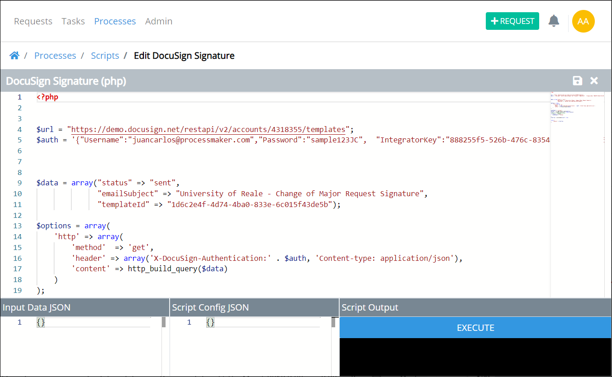

# What is Scripts Editor?


To use Scripts Editor, you must be a member of the Process Owner group. Otherwise, the **Processes** option is not available from the top menu that allows you to develop and test ProcessMaker Scripts.


## Overview

Use Scripts Editor to develop and test your ProcessMaker Scripts. Any ProcessMaker Script can be used in any process in your organization.


Access Scripts Editor in the following ways:

* [Create a new ProcessMaker Script.](../create-a-new-script.md#create-a-new-processmaker-script)
* [Edit an existing ProcessMaker Script.](../manage-scripts/edit-a-script.md#edit-a-processmaker-script)


Below is Scripts Editor displaying a ProcessMaker Script written in Lua. Scripts Editor supports Lua and PHP languages out-of-the-box.

Scripts Editor has the following panes to write and test your ProcessMaker Script:

* Develop the ProcessMaker Script below the script's name and language. Use the scroll pane to the right of the ProcessMaker script to scroll to different sections of the script. This is useful especially when you are editing a long ProcessMaker Script. For more information about Script Editor's authoring environment, see [Enter Your Script](enter-your-script.md).
* Use a JSON data model that contains Request variables.


ProcessMaker offers many open-source Lua scripts that function as-is with many third-party services. Use any of them for your own ProcessMaker Scripts. [View them here.](https://github.com/ProcessMaker/pmio-lua-connectors)


## Related Topics















