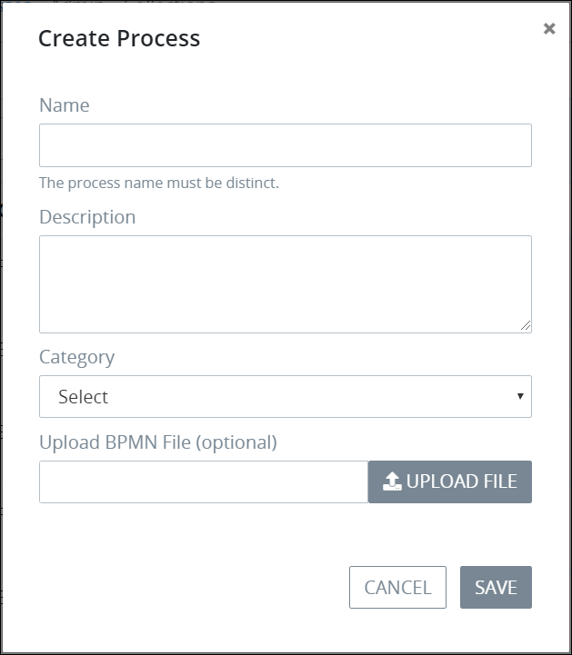

# Create a New Process


To create a new process, you must be a member of the Process Owner group. Otherwise, the **Processes** option is not available from the top menu that allows you to perform process management activities.


## Create a New Process

Follow these steps to create a new process:

1. [View your processes.](view-the-list-of-processes/#view-your-processes) The **Processes** page displays.
2. Click the **+ PROCESS** button. The **Add A Process** screen displays.  

   

3. Enter the name of the process in the **Name** field. ~~Character length limitation and/or unsupported characters?~~ This is a required field.
4. Enter a description of the process in the **Description** field. This is a required field. ~~Character length limitation and/or unsupported characters?~~
5. Select a category to associate with the process from the **Category** drop-down. This is a required field. For more information about process categories, see [Process Categories](process-categories.md).
6. Select the status of the new process. This is a required field. For more information about process statuses, see [Process Status Descriptions](view-the-list-of-processes/activate-or-deactivate-a-process.md#process-status-descriptions).
7. Click the **Save** button. The screen closes and the **Processes** page displays with your new process. Click the process name from the **Process** column to [edit the process in Process Modeler](../process-design/model-your-process.md).

## Related Topics











