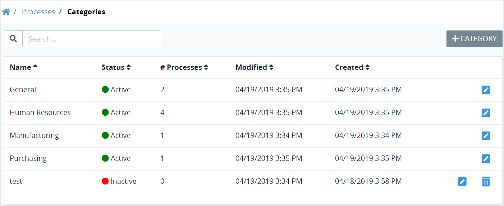
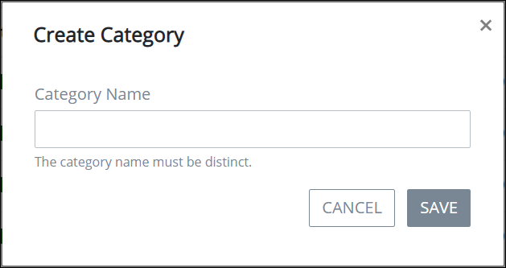
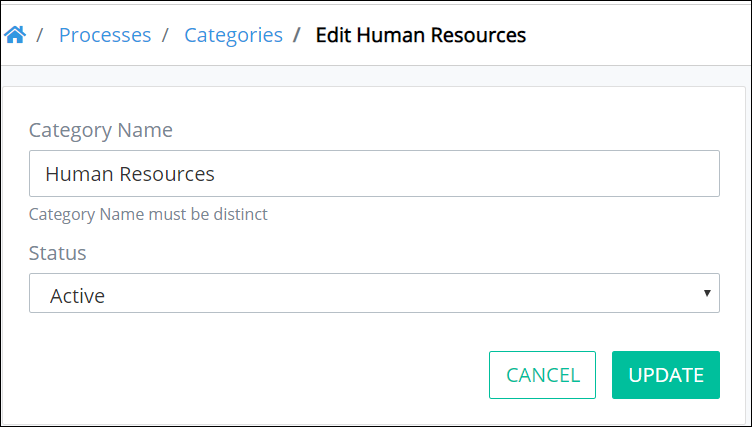
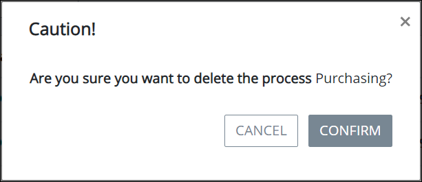

# Process Categories

## Overview

Processes for which a Request can be started can be grouped into Categories. Use Categories to organize your organizational Processes for Requesters.

Categories can be active or inactive. Processes that have been assigned to an inactive Category do not display in any Category for Requesters.

A Process can be assigned to only one Category. See [Edit Process Configuration](view-the-list-of-processes/edit-the-name-description-category-or-status-of-a-process.md#edit-configuration-information-about-a-process) for more information.

## View Process Categories


Your user account or group membership must have the "Categories: View Categories" permission to view the list of Process Categories.

See the Process [Categories](../../processmaker-administration/permission-descriptions-for-users-and-groups.md#categories) permissions or ask your ProcessMaker Administrator for assistance.


Follow these steps to view Process Categories:

1. [Log in](../../using-processmaker/log-in.md#log-in) to ProcessMaker.
2. Click the **Processes** option from the top menu. The **Processes** page displays.
3. Click the **Process Categories** icon in the left sidebar. The **Categories** page displays.

The **Categories** page displays the following information in tabular format about Process Categories:

* **Name:** The **Name** column displays the name of the Process Category.
* **Status:** The **Status** column displays the status of the Process Category. Below is a description of each status:
  * **Active:** An active Process Category can have Processes assigned to it.
  * **Inactive:** An inactive Process Category can no longer be selected when [assigning a Process to a Process Category](view-the-list-of-processes/create-a-process.md#create-a-new-process). Furthermore, Processes assigned to an inactive Category [no longer display to Process requesters](../../using-processmaker/requests/make-a-request.md#start-a-request) even though such Processes may be active.
* **Processes:** The **\# Processes** column displays how many Processes in your organization have been assigned to that Process Category.
* **Modified:** The **Modified** column displays the date and time the Process Category was last modified. The time zone setting to display the time is according to the ProcessMaker 4 server unless your [user profile's](../../using-processmaker/profile-settings.md#change-your-profile-settings) **Time zone** setting is specified.
* **Created:** The **Created** column displays the date and time the Process Category was created. The time zone setting to display the time is according to the ProcessMaker 4 server unless your [user profile's](../../using-processmaker/profile-settings.md#change-your-profile-settings) **Time zone** setting is specified.


### No Process Categories? 

If no Process Categories exist, the following message displays: **No Data Available**.

### Display Information the Way You Want It 

​[Control how tabular information displays](https://processmaker.gitbook.io/processmaker-4-community/-LPblkrcFWowWJ6HZdhC/~/drafts/-LWD5skTaOptuIWIWk76/primary/using-processmaker/control-how-requests-display-in-a-tab), including how to sort columns or how many items display per page.


## Add a New Process Category


Your user account or group membership must have the following permissions to add a new Process Category:

* Categories: View Categories
* Categories: Create Categories

See the Process [Categories](../../processmaker-administration/permission-descriptions-for-users-and-groups.md#categories) permissions or ask your ProcessMaker Administrator for assistance.


Follow these steps to add a new Process Category:

1. [View your Process Categories.](process-categories.md#view-process-categories)
2. Click the **+Category** button. The **Create New Process Category** screen displays.  

   

3. In the **Category Name** field, enter the name of the new Category. The Category name must be unique from all other Category names in your organization. This is a required field.
4. Click **Save**. The **Edit Process Category** page displays. Use this page to edit the Category's name or set its status. See [Edit a Process Category](process-categories.md#edit-a-process-category).

## Edit a Process Category


Your user account or group membership must have the following permissions to edit a Process Category:

* Categories: View Categories
* Categories: Create Categories
* Categories: Edit Categories

See the Process [Categories](../../processmaker-administration/permission-descriptions-for-users-and-groups.md#categories) permissions or ask your ProcessMaker Administrator for assistance.


Follow these steps to edit a Process Category:

1. [View your Process Categories.](process-categories.md#view-process-categories)
2. Select the **Edit** icon. The **Edit Process Category** page displays.  

   

3. Edit the following information about the Category as necessary:
   * In the **Category Name** field, edit the name of the Category if necessary. The Category name must be unique from all other Category names in your organization.
   * From the **Status** drop-down, change the status of the Category if necessary. See [View Process Categories](process-categories.md#view-process-categories).
4. Click **Update**.

## Delete a Process Category


Your user account or group membership must have the following permissions to delete a Process Category:

* Categories: View Categories
* Categories: Create Categories
* Categories: Edit Categories
* Categories: Delete Categories

See the Process [Categories](../../processmaker-administration/permission-descriptions-for-users-and-groups.md#categories) permissions or ask your ProcessMaker Administrator for assistance.



To delete a Process Category, no Processes can be assigned to it. Reassign those Processes to another Category.

Furthermore, deleting a Process Category cannot be undone.


Follow these steps to delete a Process Category:

1. [View your Process Categories.](process-categories.md#view-process-categories)
2. Select the **Delete** icon. A message displays to confirm deletion of the Category. ~~UPDATE SCREENSHOT AFTER THE CONFIRMATION MESSAGE IS FIXED.~~  

   

3. Click **Confirm** to delete the Category. The following message displays: **Category Successfully Deleted**.

## Related Topics























