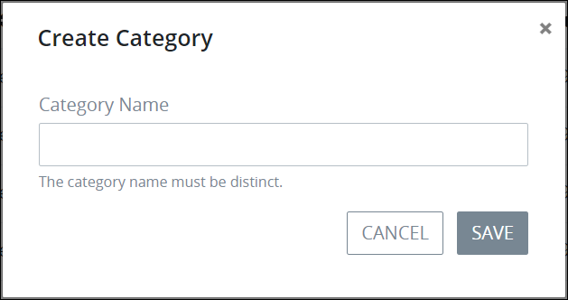
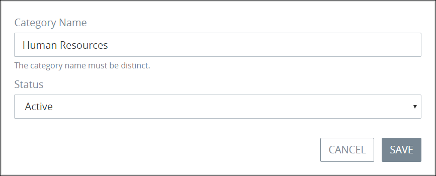

# Process Categories

Use process categories to organize your processes throughout your organization. Categories allow different departments throughout your organization to assign their business processes to their own categories.

Furthermore, categories can be activated or deactivated. ~~What value does that provide?~~

~~A process can be assigned to only one category.~~

## View Process Categories

Follow these steps to view process categories:

1. [Log in](../../using-processmaker/log-in.md#log-in) to ProcessMaker.
2. Click the **Processes** option from the top menu. The **Processes** page displays.
3. Click the **Process Categories** icon  . The **Process Categories** page displays.

The **Process Categories** page displays the following information about process categories:

* **Category:** The **Category** column displays the name of the process category.
* **Status:** The **Status** column displays the status of the process category. For a description of each process category status, see [Edit the Name or Status of a Process Category](process-categories.md#edit-the-name-or-status-of-a-process-category).
* **\#Processes:** The **\#Processes** column displays how many processes in your organization have been assigned to that process category.


[Control how tabular information displays.](../../using-processmaker/control-how-requests-display-in-a-tab.md)


## Add a New Process Category

Follow these steps to add a new process category:

1. [View process categories.](process-categories.md#view-process-categories)
2. Click the **+Category** button. The **Create New Process Category** screen displays.  

   

3. Enter the name of the new process category in the **Category Name** field. The category name must be unique from all other process category names in your organization. This is a required field.
4. Click **Save**. The **Edit Process Category** page displays. Use this page to edit the process category's name or set its status. For more information, see [Edit the Name or Status of a Process Category](process-categories.md#edit-the-name-or-status-of-a-process-category).

## Edit the Name or Status of a Process Category

Follow these steps to edit the name or status of a process category:

1. [View process categories.](process-categories.md#view-process-categories)
2. Hover your cursor over the process category and then select the **Edit** icon. The **Edit Process Category** page displays.  

   

3. Edit the name of the process category in the **Category Name** field if necessary. The process category name must be unique from all other process category names in your organization.
4. Change the status of the process category from the **Status** drop-down if necessary. Below is a description of each process category status:
   * **Active:** A process category that is in Active status can have processes assigned to it.
   * **Inactive:** A process category that is Inactive deactivates all processes assigned to that process category. ~~A process category that is in Inactive status cannot have processes assigned to it. If a process category becomes inactive, processes assigned to that category are no longer assigned to that process category and are no longer assigned to any process category.~~
5. Click **Update**. Otherwise, click **Cancel** to cancel any changes.

## Remove a Process Category


Removing a process category cannot be undone. Furthermore, no processes can be assigned to the process category for it to be removed.


Follow these steps to remove a process category:

1. [View process categories.](process-categories.md#view-process-categories)
2. Hover your cursor over the process category and then select the **Remove** icon. A message displays to confirm removal of the process category.  

   

3. Click **Confirm** to remove the process category. Otherwise, click **Cancel** to not remove the process category.


If any processes are assigned to the process category when you try to remove it, the following message displays: **The item should not have associated processes**.

Remove association all processes from the process category, and then remove the process category.


## Related Topics





