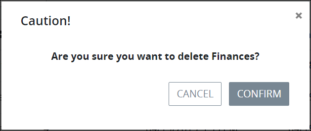

# Process Categories

Use Categories to organize your organizational Processes for Requesters.

Categories can be active or inactive. ~~What value does that provide?~~

A Process can be assigned to only one Category.

## View Process Categories

Follow these steps to view Process Categories:

1. [Log in](../../using-processmaker/log-in.md#log-in) to ProcessMaker.
2. Click the **Processes** option from the top menu. The **Processes** page displays.
3. Click the **Process Categories** icon in the left sidebar. The **Process Categories** page displays.

The **Process Categories** page displays the following information about Process Categories:

* **Name:** The **Name** column displays the name of the Process Category.
* **Status:** The **Status** column displays the status of the Process Category. Below is a description of each status:
  * **Active:** An active Process Category can have Processes assigned to it.
  * **Inactive:** An inactive Process Category can no longer be selected when [assigning a Process to a Process Category](create-a-process.md#create-a-new-process). Furthermore, Processes assigned to an inactive Category [no longer display to Process Requesters](../../using-processmaker/requests/make-a-request.md#start-a-request) even though such Processes may be active.
* **Processes:** The **\# Processes** column displays how many Processes in your organization have been assigned to that Process Category.
* **Modified:** The **Modified** column displays the date and time the Process Category was last modified. The time zone setting to display the time is according to the ProcessMaker 4 server unless your [user profile's](../../using-processmaker/profile-settings.md#change-your-profile-settings) **Time zone** setting is specified.
* **Created:** The **Created** column displays the date and time the Process Category was created. The time zone setting to display the time is according to the ProcessMaker 4 server unless your [user profile's](../../using-processmaker/profile-settings.md#change-your-profile-settings) **Time zone** setting is specified.


### No Process Categories? 

If no Process Categories exist, the following message displays: **No Data Available**.

### Display Information the Way You Want It 

​[Control how tabular information displays](https://processmaker.gitbook.io/processmaker-4-community/-LPblkrcFWowWJ6HZdhC/~/drafts/-LWD5skTaOptuIWIWk76/primary/using-processmaker/control-how-requests-display-in-a-tab), including how to sort columns or how many items display per page.


## Add a New Process Category

Follow these steps to add a new Process Category:

1. [View your Process Categories.](process-categories.md#view-process-categories)
2. Click the **+Category** button. The **Create New Process Category** screen displays.  

   

3. In the Category Name field, enter the name of the new Process Category. The Category name must be unique from all other Process Category names in your organization. This is a required field.
4. Click **Save**. The **Edit Process Category** page displays. Use this page to edit the Process Category's name or set its status. See [Edit a Process Category](process-categories.md#edit-a-process-category).

## Edit a Process Category

Follow these steps to edit a Process Category:

1. [View your Process Categories.](process-categories.md#view-process-categories)
2. Select the **Edit** icon. The **Edit Process Category** page displays.  

   

3. Edit the name of the process category in the **Category Name** field if necessary. The process category name must be unique from all other process category names in your organization.
4. Change the status of the process category from the **Status** drop-down if necessary. See [View Process Categories](process-categories.md#view-process-categories) for a description of each status.
5. Click **Update**. Otherwise, click **Cancel** to cancel any changes.

## Delete a Process Category


To delete a Process Category, no Processes can be assigned to it. Reassign those Processes to another Category.

Furthermore, deleting a Process Category cannot be undone.


Follow these steps to delete a Process Category:

1. [View your Process Categories.](process-categories.md#view-process-categories)
2. Select the **Delete** icon. A message displays to confirm deletion of the Process Category.  

   

3. Click **Confirm** to delete the Process Category. Otherwise, click **Cancel** to not remove the Process Category.

   If Confirm is selected, the following message displays: **Category Successfully Deleted**.

## Related Topics











