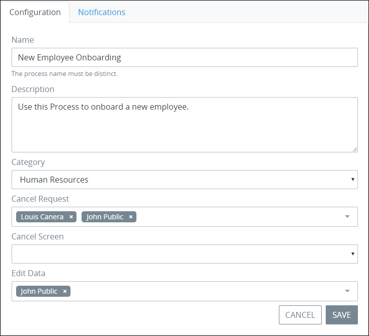

# Manage Processes

## View Your Processes

ProcessMaker displays all processes in one table that Process Owners throughout your organization have designed. This makes it easy to manage processes.


To view processes, your Process Administrator must add you to the Process Owner group. Otherwise, the **Processes** option in the top menu is not available.


Follow these guidelines to view your processes:

1. [Log in](../../using-processmaker/log-in.md#log-in) to ProcessMaker.
2. Click the **Processes** option from the top menu. The **Processes** page displays.


Click the **Processes**  icon when you are in other process-related pages to view the **Processes** page.


The **Processes** page displays the following information about processes:

* **Process:** The **Process** column displays the process name. ~~Click the process name to edit the process in Process Modeler.~~
* **Category:** The **Category** column displays in which process category the process was assigned when the process was created.  For more information about categories, see [Process Categories](process-categories.md).
* **Status:** The **Status** column displays the status of the process. For a description of possible status types, see [Edit the Name, Description, Category, or Status of a Process](view-the-list-of-processes.md#edit-the-name-description-category-or-status-of-a-process).
* **Modified By:** The **Modified By** column displays the full name of who last modified the process.
* **Modified:** The **Modified** column displays the date the processes was last modified.
* **Created:** The **Created** column displays the date the process was created.


Removing a process from the **Processes** page cannot be undone.



If no processes exist, the following message displays: **You don't have any processes. Please click on '+Process' to get started.**



[Control how tabular information displays.](../../using-processmaker/control-how-requests-display-in-a-tab.md)


## Edit the Name, Description, Category, or Status of a Process

Follow these steps to edit the name, description, category, or status of a process:

1. [View your processes.](view-the-list-of-processes.md#view-your-processes)
2. Hover your cursor over the process and then select the **Edit** icon. The **Edit Process** page displays.  

   

3. Change the process name in the **Process title** field if necessary.
4. Edit or enter a description of the process in the **Description** field if necessary.
5. Select to which category to assign the process from the **Category** drop-down. For more information about process categories and how they affect processes assigned to them, see [Process Categories](process-categories.md).
6. Select from which step in the process ~~to display its form as an avatar~~ from the **Summary screen** drop-down.
7. Change the status of the process from the **Status** drop-down if necessary. Below is a description of each status:
   * **Active:** When a process is Active status, new Requests can be started using that process.
   * **Inactive:** When a process is Inactive status, new Requests cannot be started using that process. ~~However, active Requests using that inactive process can be completed.~~
8. Click **Update**. Otherwise, click **Cancel** to cancel any changes.

## Activate or Deactivate a Process


When a process is Inactive status, new Requests cannot be started using that process. ~~However, active Requests using that inactive process can be completed.~~


Do one of the following to activate or deactivate a process:

* Change the **Status** option from the [Edit Process page](view-the-list-of-processes.md#edit-the-name-description-category-or-status-of-a-process).
* Hover your cursor over the process and then select the **Activate**/**Deactivate** icon/.

## Preview a Process

Follow these steps to preview a process:

1. [View your processes.](view-the-list-of-processes.md#view-your-processes)
2. Hover your cursor over the process and then select the **See** icon. ~~What happens?~~

## Remove a Process

Follow these steps to remove a process:

1. [View your processes.](view-the-list-of-processes.md#view-your-processes)
2. 
## Related Topics













