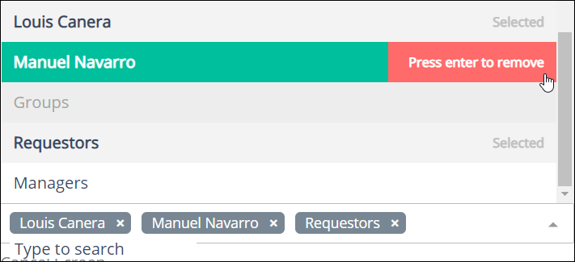
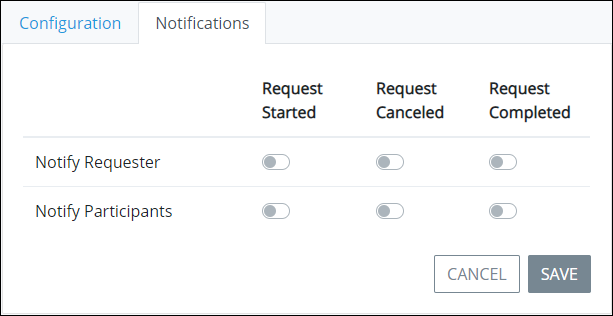

# Configure a Process

## Configure a Process


### Looking for Process Model Editing?

Process configuration is different than Process model editing. See [Model Your Process](../../process-design/model-your-process/) for topics.

### Permissions Required

Your user account or group membership must have the following permissions to configure a Process's configuration:

* Processes: View Processes
* Processes: Edit Processes

See the [Process](../../../processmaker-administration/permission-descriptions-for-users-and-groups.md#processes) permissions or ask your ProcessMaker Administrator for assistance.


Follow these steps to configure a Process:

1. [View your active Processes.](./#view-your-processes) The **Processes** page displays.
2. Select the **Configure** iconfor your Process. The **Edit** page displays.  

   

3. Edit the following Process configuration as necessary:
   * In the **Name** field, edit the Process name. This is a required field.
   * In the **Description** field, edit the description of the Process. This is a required field.
   * From the **Category** drop-down, select to which category to assign the Process. This is a required field. See [Process Categories](../process-categories.md) for more information how this affects new [Requests](../../../using-processmaker/requests/what-is-a-request.md) for the Process.
   * From the **Cancel Request** drop-down, specify from which users or groups have permission to cancel Requests from this Process. If no users or groups are selected, no one can cancel a Request from this Process. Follow these guidelines:

     * **Select User\(s\)/Group\(s\):** Select which user\(s\) and/or group\(s\) have permission to cancel Requests from this Process. Multiple users and/or can be selected. Use **Shift** to select multiple consecutive users/groups or use **Ctrl** to select multiple non-consecutive users/groups.
     * **Remove User\(s\)/Group\(s\):** To remove a user or group added to this field, either click the iconfor that user/group or mouse-hover over the user/group and press **Enter**.   

     

   * From the **Cancel Screen** drop-down, select a ProcessMaker Screen to display when a Request for this Process is canceled.
   * From the **Edit Data** drop-down, specify from which users or groups have permission to [edit Request data](../../../using-processmaker/requests/request-details.md#editable-request-data) from this Process. If no users or groups are selected, no one can edit Request data from this Process. Follow these guidelines:
     * **Select User\(s\)/Group\(s\):** Select which user\(s\) and/or group\(s\) have permission to edit Request data from this Process. Multiple users and/or can be selected. Use **Shift** to select multiple consecutive users/groups or use **Ctrl** to select multiple non-consecutive users/groups.
     * **Remove User\(s\)/Group\(s\):** To remove a user or group added to this field, either click the iconfor that user/group or mouse-hover over the user/group and press **Enter**.   

       
   * Select the **Pause Timer Start Events** checkbox to pause [Start Timer Event](../../process-design/model-your-process/add-and-configure-start-timer-event-elements.md) elements configured in the Process model.
4. Click **Save**.

## Configure Process Notifications


Your user account or group membership must have the following permissions to configure a Process's notifications:

* Processes: View Processes
* Processes: Edit Processes

See the [Process](../../../processmaker-administration/permission-descriptions-for-users-and-groups.md#processes) permissions or ask your ProcessMaker Administrator for assistance.


Configure Process notifications to notify Process Requesters and/or Request participants when any of the following Request events occur:

* **Request started:** A Request for this Process was started.
* **Request canceled:** A Request for this Process was canceled.
* **Request completed:** A Request for this Process was completed.

Process notifications can be sent to the following sets of users or group members:

* **Requester:** A Requester is any user or group member who has been granted permission to start a Request for this Process.
* **Request participants:** A Request participant is any user or group member who participates in a specific Request for this Process. Generally, a Request participant is an individual who does a Task in the Request.

Follow these steps to edit Process configuration notifications:

1. [View your active Processes.](./#view-your-processes) The **Processes** page displays.
2. Select the **Config** iconfor your Process. The **Edit** page displays.
3. Click the **Notifications** tab.  

   

4. Toggle any of the following settings as necessary:
   * **Request Started:** Toggle the **Request Started** setting to notify/not notify Requesters and/or Request participants that a Request from this Process has started.
   * **Request Canceled:** Toggle the **Request Canceled** setting to notify/not notify Requesters and/or Request participants that a Request from this Process has been canceled.
   * **Request Completed:** Toggle the **Request Completed** setting to notify/not notify Requesters and/or Request participants that a Request from this Process has completed.
5. Click **Save**.

## Related Topics



















