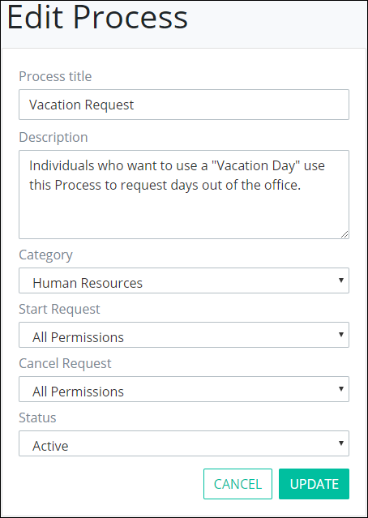

# Edit the Name, Description, Category, or Status of a Process


To edit general process information, you must be a member of the Process Owner group. Otherwise, the **Processes** option is not available from the top menu that allows you to perform process management activities.


## Edit General Information About a Process

Follow these steps to edit the name, description, category, or status of a process:

1. [View your processes.](./#view-your-processes) The **Processes** page displays.
2. Hover your cursor over the process in which to edit its information and then select the **Edit** icon. The **Edit Process** page displays.  

   

3. Edit the process name in the **Process title** field if necessary.
4. Edit the description of the process in the **Description** field if necessary.
5. Select to which category to assign the process from the **Category** drop-down. For more information about process categories and how they affect processes assigned to them, see [Process Categories](../process-categories.md).
6. Select from which step in the process ~~to display its form as an avatar~~ from the **Summary screen** drop-down.
7. Change the status of the process from the **Status** drop-down if necessary. For more information about process statuses, see [Process Status Descriptions](activate-or-deactivate-a-process.md#process-status-descriptions).
8. Click **Update**. Otherwise, click **Cancel** to cancel any changes.

## Related Topics

















