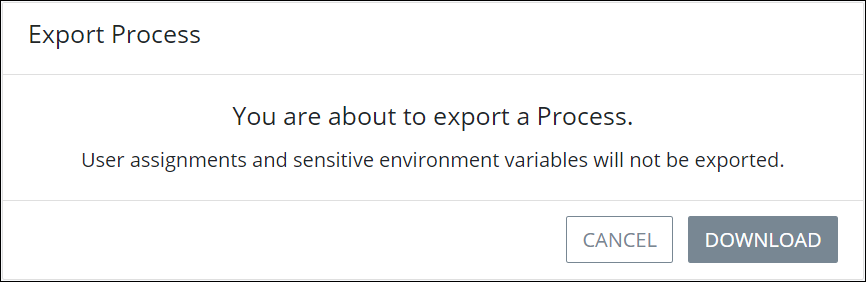

# Export a BPMN-Compliant Process

## Overview

Export Processes from ProcessMaker 4 that are BPMN 2.0 compliant. The exported Process may then be [imported](import-a-bpmn-compliant-process.md) to the same or another ProcessMaker 4 instance of the same product version and/or imported to a third-party BPMN 2.0 compliant tool. If the exported Process is imported to a third-party tool, all ProcessMaker features that are not part of the [BPMN 2.0 specification](https://www.omg.org/spec/BPMN/2.0/About-BPMN/) are ignored.

The following ProcessMaker 4 components are exported if they are specified in the Process:

* [ProcessMaker Scripts](../../scripts/what-is-a-script.md) configured for [Script Task elements](../../process-design/model-your-process/add-and-configure-script-task-elements.md) as well as their Script configurations
* [ProcessMaker Screens](../../design-forms/what-is-a-form.md) configured for [Task elements](../../process-design/model-your-process/add-and-configure-task-elements.md) as well as routing rule expressions
* [Sequence Flows](../../process-design/model-your-process/the-quick-toolbar.md) and their routing rule expressions
* [ProcessMaker Environment Variables](../../environment-variable-management/what-is-an-environment-variable.md), but not the sensitive data an Environment Variable contained in the original Process

ProcessMaker 4 does not export [users](../../../processmaker-administration/add-users/what-is-a-user.md) or [groups](../../../processmaker-administration/assign-groups-to-users/what-is-a-group.md) associated with the original ProcessMaker 4 Process. Therefore, Task element assignments are not exported and must be configured if the Process is imported to another ProcessMaker 4 instance or third-party tool.

## Export a BPMN 2.0 Compliant Process


Your user account or group membership must have the following permissions to export a Process:

* Processes: View Processes
* Processes: Export Processes

See the [Process](../../../processmaker-administration/permission-descriptions-for-users-and-groups.md#processes) permissions or ask your ProcessMaker Administrator for assistance.



ProcessMaker 4 Processes that are not BPMN 2.0 compliant can be exported successfully. However, that Process will not import successfully. Therefore, ensure that your Process is BPMN 2.0 compliant before exporting it. See ~~TOPIC~~.


Follow these steps to export a BPMN 2.0 compliant Process:

1. [View your active Processes.](./#view-your-processes) The **Processes** page displays.
2. Select the **Export** iconfor your Process. The following message displays: **You are about to export a Process. User assignments and sensitive environment variables will not be exported.**  

   

3. Click **Download**. ProcessMaker 4 exports the Process using the original Process name except spaces in the name are replaced with underscores \(`_`\). The file has the extension `.bpm4`. ProcessMaker 4 exports the `.bpm4` file to your local computer. The following message displays when the Process exports successfully: **The process was exported.**

## Related Topics





















