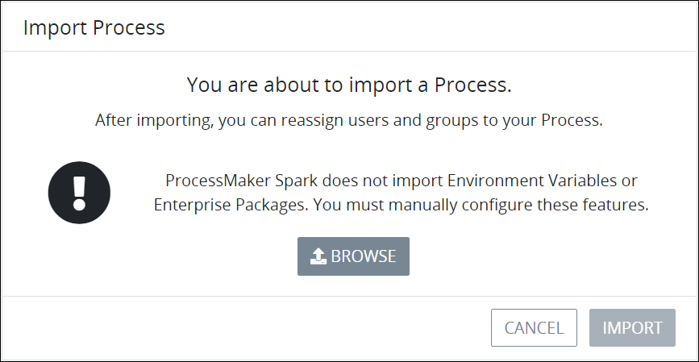
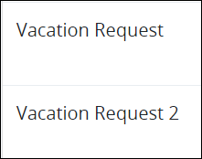

# Import a BPMN-Compliant Process

## Overview

Import Processes into ProcessMaker Spark if the Process to be imported is BPMN 2.0 compliant.

### Import Valid ProcessMaker Spark Processes

Import valid ProcessMaker Spark Processes that have been [exported](export-a-bpmn-compliant-process.md) from ProcessMaker Spark if the Process was exported from the same [ProcessMaker Spark version](../../../using-processmaker/application-version-details.md#view-processmaker-version-information). A valid ProcessMaker Spark Process is [BPMN 2.0 compliant](https://www.omg.org/spec/BPMN/2.0/About-BPMN/). The Process can be imported from the same or different ProcessMaker Spark instance.

The following ProcessMaker Spark components are imported from a valid ProcessMaker Spark Process if they are specified in that Process:

* [ProcessMaker Scripts](../../scripts/what-is-a-script.md) configured for [Script Task elements](../../process-design/model-your-process/add-and-configure-script-task-elements.md) as well as their Script configurations
* [ProcessMaker Screens](../../design-forms/what-is-a-form.md) configured for [Task elements](../../process-design/model-your-process/add-and-configure-task-elements.md) as well as routing rule expressions
* [Sequence Flows](../../process-design/model-your-process/the-quick-toolbar.md) and their routing rule expressions
* [ProcessMaker Environment Variables](../../environment-variable-management/what-is-an-environment-variable.md), but not the sensitive data an Environment Variable contained in the original Process

ProcessMaker Spark does not import [users](../../../processmaker-administration/add-users/what-is-a-user.md) or [groups](../../../processmaker-administration/assign-groups-to-users/what-is-a-group.md) associated with the original ProcessMaker Spark Process. Therefore, Task element assignments are not imported and must be configured after importing the Process.

### Import BPMN 2.0 Compliant Processes from Third-Party Modeling Applications

ProcessMaker Spark supports importing third-party processes if those processes are compliant to the [BPMN 2.0 specification](https://www.omg.org/spec/BPMN/2.0/About-BPMN/). When importing BPMN 2.0 compliant processes, ProcessMaker imports the Process model that can be opened in [Process Modeler](../../process-design/what-is-process-modeling.md). ProcessMaker Spark ignores any functionality that the third-party tool may support that is not part of the BPMN 2.0 specification.

Despite that the imported Process is BPMN 2.0 compliant, you may need to edit the Process in Process Modeler for ProcessMaker Spark specific functionality.

## Import a BPMN 2.0 Compliant Process


Your user account or group membership must have the following permissions to import a Process:

* Processes: View Processes
* Processes: Import Processes

See the [Process](../../../processmaker-administration/permission-descriptions-for-users-and-groups.md#processes) permissions or ask your ProcessMaker Administrator for assistance.


Follow these steps to import a Process:

1. [View your active Processes.](./#view-your-processes) The **Processes** page displays.
2. Click the **Import** button. The following message displays: **You are about to import a Process. User assignments and sensitive environment variables will not be imported.**  

   

3. Click **Browse** to locate the source BPMN 2.0 compliant Process to import. ProcessMaker Spark Processes have the `.bpm4` file extension.
4. Click **Import**. If the source Process imports successfully, the **Processes** page displays. The imported Processes is named identically to the source Process except with the number "2" suffix.  

   


If the source BPMN 2.0 compliant Process cannot import successfully, the following message displays: **Unable to import the process.** Ensure that the source Process is BPMN 2.0 compliant.


## Related Topics























