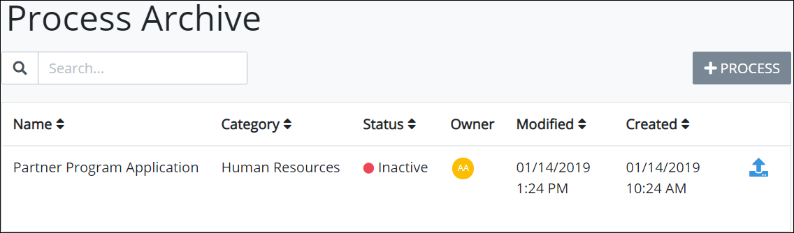
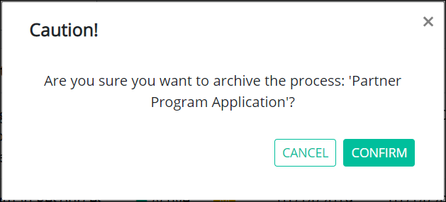

# Archive a Process

## What is an Archived Process?

An archived Process has the following attributes:

* Archived Processes are disabled and inactive until they are [restored](restore-a-process.md#restore-a-process).
* All archived Processes in the organization are accessible from the **Process Archive** page. See [View Archived Processes](remove-a-process.md#view-archived-processes).
* A Process with in-progress Requests can be archived. In-progress Requests will complete.

## View Archived Processes

Follow these steps to view all archived Processes in your organization:

1. [Log in](../../../using-processmaker/log-in.md#log-in) to ProcessMaker.
2. Click the **Processes** option from the top menu. The **Processes** page displays.
3. Click the **Archived Processes** iconin the left sidebar. The **Process Archive** page displays all archived Processes in your organization.


Click the **Archived Processes** iconin the left sidebar when you are in other Process-related pages to view the **Process Archive** page.


## Archive a Process


Your user account or group membership must have the following permissions to archive a Process:

* Processes: View Processes
* Processes: Edit Processes

Ask your ProcessMaker Administrator for assistance.



When a Process is archived ~~describe what happens and in which conditions a process can be removed.~~


Follow these steps to archive a Process:

1. [View your Processes.](./#view-your-processes) The **Processes** page displays.
2. Select the **Archive** iconfor your Process. A message displays to confirm archiving the Process.  

   

3. Click **Confirm** to archive the Process. The following message displays: **Process Archived**. The Process moves from the **Processes** page to the **Process Archive** page. See [View Archived Processes](remove-a-process.md#view-archived-processes). Also see [Restore an Archived Process](restore-a-process.md#restore-a-process).

## Related Topics















