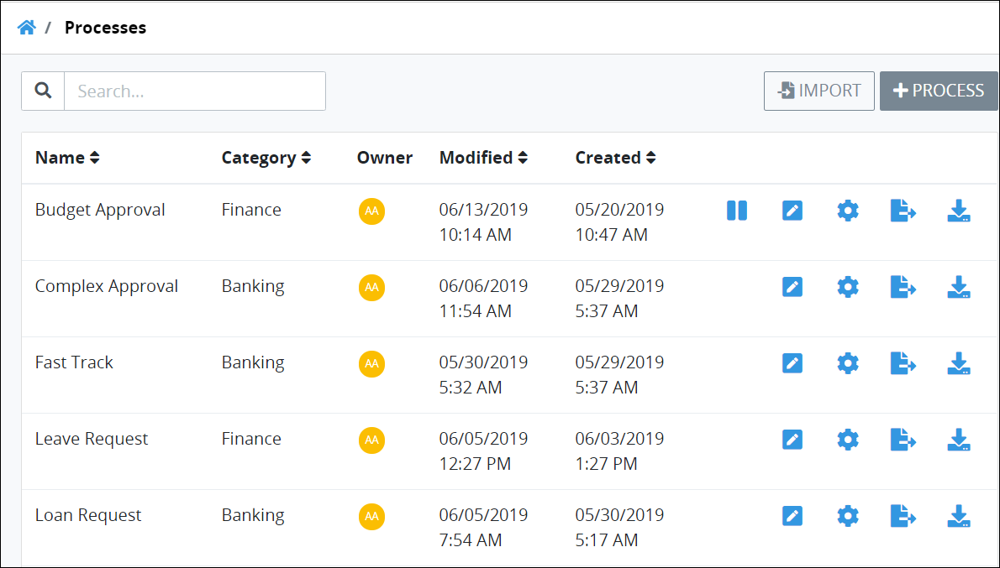

# View Your Processes

ProcessMaker displays all processes in one table that Process Owners throughout your organization have modeled. This makes it easy to manage processes.


To view processes, you must be a member of the Process Owner group. Otherwise, the **Processes** option is not available from the top menu that allows you to perform process management activities.


## View Your Processes

Follow these guidelines to view your processes:

1. [Log in](../../../using-processmaker/log-in.md#log-in) to ProcessMaker.
2. Click the **Processes** option from the top menu. The **Processes** page displays all processes modeled from all Process Owners in your organization.


Click the **Processes**  icon when you are in other process-related pages to view the **Processes** page.


The **Processes** page displays the following information about processes:

* **Process:** The **Process** column displays the process name. ~~Click the process name to edit the process in Process Modeler.~~
* **Category:** The **Category** column displays in which process category the process was assigned when the process was created.  For more information about categories, see [Process Categories](../process-categories.md).
* **Status:** The **Status** column displays the status of the process. For a description of possible status types, see [Edit the Name, Description, Category, or Status of a Process](./#edit-the-name-description-category-or-status-of-a-process).
* **Modified By:** The **Modified By** column displays the full name of who last modified the process.
* **Modified:** The **Modified** column displays the date the processes was last modified.
* **Created:** The **Created** column displays the date the process was created.


Removing a process from the **Processes** page cannot be undone.



For information how to search for a process, see [Search for a Process](search-for-a-process.md).



If no processes exist, the following message displays: **You don't have any processes. Please click on '+Process' to get started.**



[Control how tabular information displays.](../../../using-processmaker/control-how-requests-display-in-a-tab.md)


## Related Topics

















