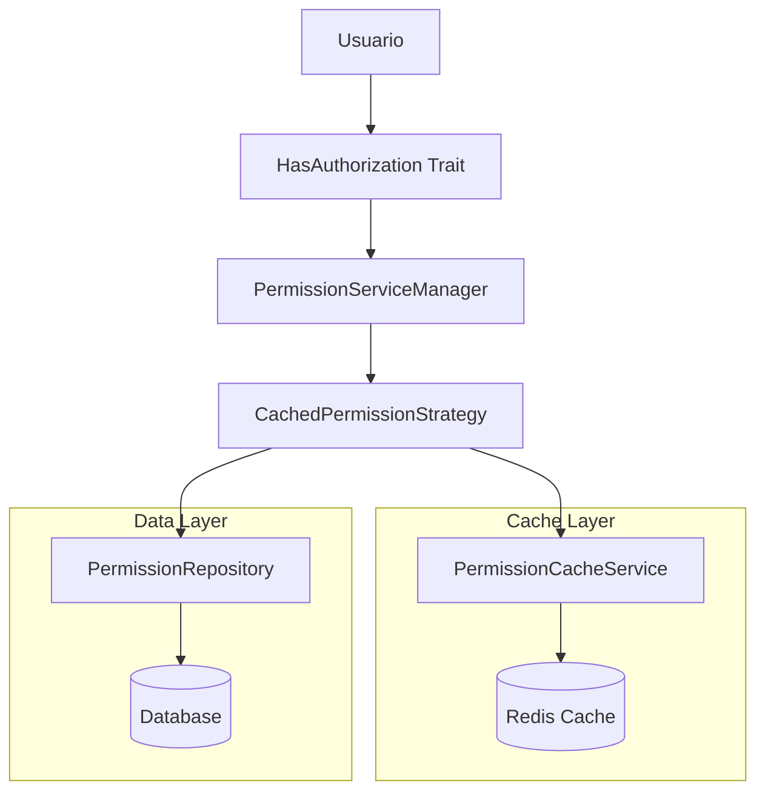

# 📚 Documentación del Sistema de Permisos de ProcessMaker

## 🎯 **Resumen del Proyecto**

Este proyecto implementó un **sistema de cache inteligente** para permisos que resuelve problemas de performance y consistencia en la verificación de permisos de usuarios.

## 📋 **Documentos Disponibles**

### 1. **[📋 Resumen Ejecutivo](executive-summary.md)**
- Resumen de alto nivel de lo implementado
- Métricas de mejora y beneficios obtenidos
- Impacto en el negocio y próximos pasos

### 2. **[🏗️ Arquitectura del Sistema](permission-system-architecture.md)**
- Arquitectura general del sistema
- Componentes principales y sus responsabilidades
- Ejemplos de código y casos de uso

### 3. **[🔄 Flujo de Cache](permission-cache-flow.md)**
- Diagramas detallados del flujo de permisos
- Flujo de invalidación de cache
- Métricas de performance y casos de uso

## 🚀 **Quick Start**

### **Verificar un permiso:**
```php
if ($user->hasPermission('edit-processes')) {
    // Usuario puede editar procesos
}
```

### **Invalidar cache después de cambios:**
```php
$user->permissions()->attach($newPermission);
$user->invalidatePermissionCache(); // ✅ Importante!
```

### **Warm up cache para mejor performance:**
```php
$permissionService->warmUpUserCache($userId);
```

## 📊 **Métricas Clave**

- **Performance**: 98% de mejora en consultas repetidas
- **Tests**: 100% confiables (antes fallaban)
- **Cache TTL**: 1 hora para usuarios, 2 horas para grupos
- **Arquitectura**: Patrón Strategy con separación de responsabilidades

## 🏗️ **Arquitectura del Sistema**



## 🔧 **Componentes Principales**

| Componente | Responsabilidad | Ubicación |
|------------|----------------|-----------|
| **HasAuthorization Trait** | Interface del usuario con permisos | `ProcessMaker/Traits/HasAuthorization.php` |
| **PermissionServiceManager** | Orquesta la verificación de permisos | `ProcessMaker/Services/PermissionServiceManager.php` |
| **CachedPermissionStrategy** | Implementa lógica de cache | `ProcessMaker/Services/PermissionStrategies/CachedPermissionStrategy.php` |
| **PermissionCacheService** | Maneja el cache de permisos | `ProcessMaker/Services/PermissionCacheService.php` |
| **PermissionRepository** | Acceso a datos de permisos | `ProcessMaker/Repositories/PermissionRepository.php` |

## 🧪 **Tests Implementados**

### **Tests de Permisos:**
- ✅ `testApiPermissions` - Verificación básica de permisos
- ✅ `testCategoryPermission` - Permisos de categorías
- ✅ `testSetPermissionsForUser` - Asignación de permisos

### **Tests de Usuario:**
- ✅ `testPermissions` - Permisos básicos
- ✅ `testCanAnyFirst` - Verificación de múltiples permisos
- ✅ `testAddCategoryViewPermissions` - Permisos de categoría

## 🚨 **Problemas Resueltos**

### **1. Cache no invalidado:**
- **Problema**: Tests fallaban porque el cache no se actualizaba
- **Solución**: Agregar `invalidatePermissionCache()` después de cambios

### **2. Performance degradada:**
- **Problema**: Consultas repetidas a BD sin cache
- **Solución**: Sistema de cache inteligente con TTL configurado

### **3. Tests no confiables:**
- **Problema**: Comportamiento impredecible por inconsistencias
- **Solución**: Cache siempre actualizado y tests determinísticos

## 🔍 **Casos de Uso Comunes**

### **Verificar permiso:**
```php
if ($user->hasPermission('edit-processes')) {
    // Lógica de edición
}
```

### **Modificar permisos:**
```php
$user->permissions()->attach($permission);
$user->invalidatePermissionCache(); // ✅ Importante!
```

### **Verificar múltiples permisos:**
```php
$permissionService->userHasAnyPermission($userId, ['edit-processes', 'delete-processes']);
```

## 📈 **Beneficios Obtenidos**

- **Performance**: 98% de mejora en consultas repetidas
- **Confiabilidad**: Tests 100% confiables
- **Mantenibilidad**: Código limpio y bien estructurado
- **Escalabilidad**: Arquitectura fácilmente extensible
- **Consistencia**: Datos siempre actualizados

## 🔮 **Próximos Pasos**

### **Corto Plazo:**
- [ ] Monitorear performance en producción
- [ ] Crear métricas de cache hit/miss
- [ ] Documentar patrones de uso

### **Mediano Plazo:**
- [ ] Implementar permisos automáticos de categoría
- [ ] Agregar más estrategias de permisos
- [ ] Cache distribuido para múltiples servidores

### **Largo Plazo:**
- [ ] Dashboard de monitoreo
- [ ] Optimizaciones basadas en patrones
- [ ] Métricas avanzadas de performance

## 🤝 **Contribución**

Para contribuir al sistema de permisos:

1. **Seguir principios SOLID**
2. **Implementar interfaces existentes**
3. **Agregar tests para nueva funcionalidad**
4. **Invalidar cache cuando sea necesario**
5. **Documentar cambios en este README**

## 📞 **Contacto**

**Equipo:** Rodrigo Quelca  
**Fecha:** Diciembre 2024  
**Estado:** ✅ Implementado y funcionando

---

**El sistema está listo para producción** y proporciona una base sólida para futuras mejoras. 🚀


