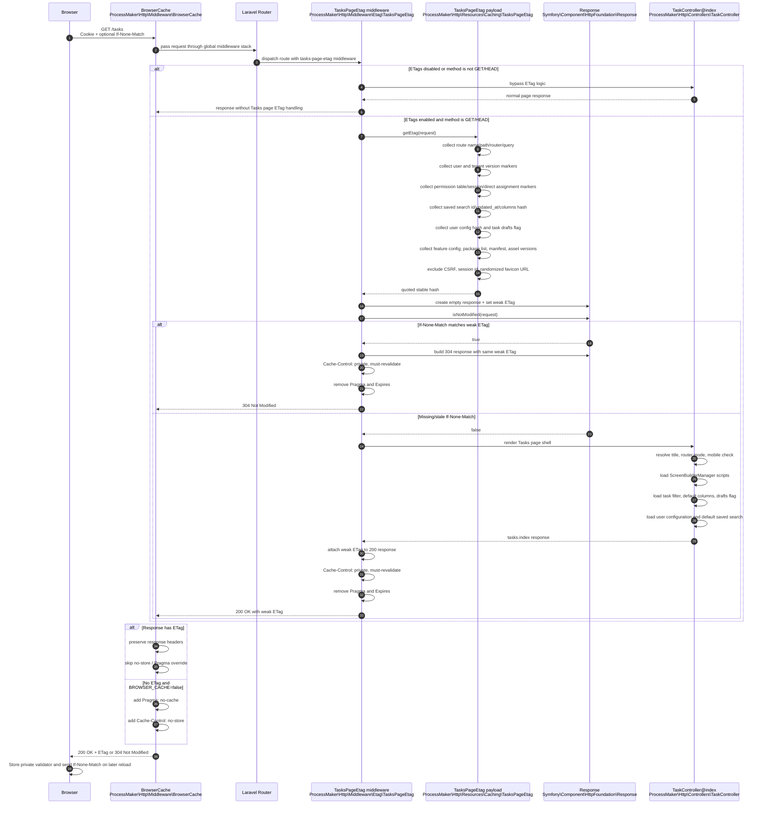

# Tasks Page ETag Sequence

This diagram captures the current request flow for the Tasks page shell (`/tasks`). The route-specific middleware computes a stable Tasks page ETag before rendering, short-circuits matching conditional requests with `304 Not Modified`, and sets private revalidation headers. The legacy inbox route (`/inbox/{router?}`) remains on the original `no-cache` middleware path and does not use this ETag flow. The global browser-cache middleware preserves ETag-enabled responses instead of applying `no-store`.




## ETag Context

The payload intentionally includes content-affecting values:

- Route path/query/router state.
- Authenticated user id, update timestamp, locale, timezone, display fields, and admin status.
- Tenant id and tenant update timestamp when present.
- Permission table version, session permission snapshot, direct user/group assignment hashes, and direct group membership version.
- Task filter cache, user configuration hash, task draft flag, and saved search defaults hash.
- Page-relevant feature config, registered package list, package manifest, app version, `composer.lock`, and `mix-manifest.json`.

The payload intentionally excludes volatile values that do not define the rendered page, such as CSRF token, session id, and randomized favicon URLs.

## Header Outcome

Successful Tasks page responses should use private revalidation rather than storage blocking:

```http
Cache-Control: private, must-revalidate
ETag: W/"..."
Vary: Accept-Encoding
```

They should not include `no-store` or `Pragma: no-cache`; otherwise the browser will not keep the validator and will not send `If-None-Match`.
