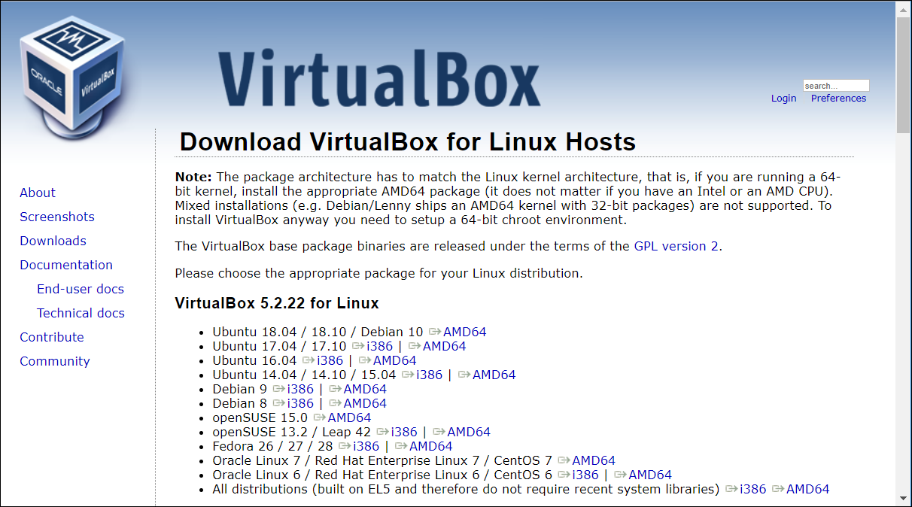
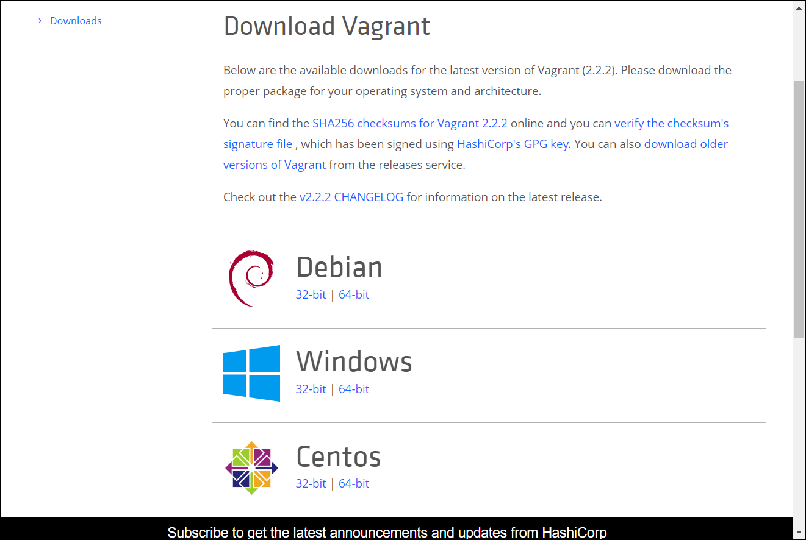

# Install ProcessMaker


The following installation instructions are for the ProcessMaker Community edition internal beta. The internal beta is a developer-oriented installation procedure.

The installation procedure described below installs prerequisite applications and then installs the internal beta for ProcessMaker 4 Community edition.

Ensure you meet [installation requirements](prerequisites.md) prior to starting this installation procedure.

The following installation procedure instructs how to install the internal beta on Debian Linux. However, notes how to install the internal beta on Ubuntu Linux 18.04 are included that vary from Debian Linux instructions.


## Install Prerequisites

### Update Packages



```text
apt-get update && apt-get upgrade
```



In order to install ProcessMaker 4 you will need the following:

* [VirtualBox 5.2.22](install-processmaker-on-premise.md#install-virtualbox-5-2-22)
* [Vagrant 2.2.2](install-processmaker-on-premise.md#install-vagrant-2-2-1)
* [PHP 7.2](install-processmaker-on-premise.md#install-php-7-2)
* [Composer](install-processmaker-on-premise.md#install-composer)
* [Node.js 10.13.0](install-processmaker-on-premise.md#install-node-js-10-13-0)

### **Install VirtualBox 5.2.22**

[Download VirtualBox](https://www.virtualbox.org/wiki/Linux_Downloads) for your Linux distribution.



Install the VirtualBox package using one of the following commands depending on your Linux distribution to which you are installing VirtualBox.





```text
rpm -Uvh [file name].rpm
```







```text
dpkg -i [file name].deb
```







```text
dpkg -i [file name].deb
```





After the installation finishes, VirtualBox sometimes does not work. VirtualBox may require the gcc, make, and perl libraries as well as the kernel "header" in order to rebuild a missing module. If this happens run the following command:



```text
apt-get install gcc make perl kernel-devel
```




In Ubuntu Linux 18.04, instead of `kernel-devel` use `linux-headers-generic`.

For Debian Linux 9 use `linux-headers-4.9.0-4-amd64`.

In any case it will tell you which version it needs.


Then run the following command to finish the VirtualBox installation:



```text
sudo /sbin/vboxconfig
```



As an alternative try running the following command:



```text
sudo apt-get -f install 
```



Verify that VirtualBox works correctly.

### Install Vagrant 2.2.2

[Download Vagrant](https://www.vagrantup.com/downloads.html) for Linux. It will download a file with the `.deb` extension.





```text
dpkg -i [file name].deb
```



Verify if it is installed correctly.



```text
vagrant -v
```



### Install PHP 7.2

Install on:

* [Debian or Kali](install-processmaker-on-premise.md#install-on-debian)
* [Ubuntu or Mint](install-processmaker-on-premise.md#install-on-ubuntu)

#### Install on Debian Linux

Perform the following commands to install PHP 7.2 on Debian Linux:



```text
wget -q https://packages.sury.org/php/apt.gpg -O- | sudo apt-key add -
echo "deb https://packages.sury.org/php/ stretch main" | sudo tee /etc/apt/sources.list.d/php.list
```





```text
sudo apt-get update && apt-get upgrade
```



If an error displays as follows:

```text
Reading package lists... Done
E: The method driver /usr/lib/apt/methods/https could not be found.
N: Is the package apt-transport-https installed?
E: Failed to fetch https://packages.sury.org/php/dists/stretch/InRelease
E: Some index files failed to download. They have been ignored, or old ones used instead.
```

Install the following program:

```text
sudo apt-get install ca-certificates apt-transport-https
```

Then run again the `update` and `upgrade` command:



```text
sudo apt-get install php7.2 php7.2-cli php7.2-common php7.2-opcache php7.2-curl php7.2-mbstring php7.2-mysql php7.2-zip php7.2-xml
```





```text
php -v
```



#### Install on Ubuntu Linux

Perform the following commands to install PHP 7.2 on Ubuntu Linux:


If your Linux distribution already has PHP 7.2 you do not need to add the repository. Go directly to command 4.




```text
apt-get install software-properties-common
```





```text
add-apt-repository ppa:ondrej/php
```





```text
apt-get update
```





```text
apt-get install php7.2
apt-get install php-pear php7.2-curl php7.2-dev php7.2-gd php7.2-mbstring php7.2-zip php7.2-mysql php7.2-xml
```





```text
php -v
```



### Install Composer

Perform the following commands to install Composer:



```text
wget https://getcomposer.org/composer.phar
mv composer.phar composer
```





```text
chmod +x composer
```





```text
mv composer /usr/local/bin
```





```text
composer
```



### Install Node.js 10.13.0

Perform the following commands to install Node.js 10.13.0:



```text
VERSION=v10.13.0
DISTRO=linux-x64
```





```text
cd /opt/
wget https://nodejs.org/download/release/v10.13.0/node-v10.13.0-linux-x64.tar.xz
```





```text
mkdir /usr/local/lib/nodejs
tar -xJvf node-$VERSION-$DISTRO.tar.xz -C /usr/local/lib/nodejs
```





```text
mv /usr/local/lib/nodejs/node-$VERSION-$DISTRO /usr/local/lib/nodejs/node-$VERSION
```





```text
echo "VERSION=v10.13.0" >> ~/.bashrc
echo "DISTRO=linux-x64" >> ~/.bashrc
echo 'export NODEJS_HOME=/usr/local/lib/nodejs/node-$VERSION/bin' >> ~/.bashrc
echo 'export PATH=$NODEJS_HOME:$PATH' >> ~/.bashrc
. ~/.bashrc
```





```text
node -v
```



## Install ProcessMaker

Perform the following commands to install ProcessMaker 4 internal beta:



```text
apt-get install git
```





```text
git clone https://github.com/ProcessMaker/bpm.git
```





```text
cd bpm/
```





```text
composer install
```



Before you go to the next step, verify if npm is already installed:

```text
npm -v
```

If you not have npm installed, continue with command 5 \(install the package manager\). If you do have npm installed, skip to command 6 \(run the manager inside the project\).



```text
apt-get install npm@latest -g
```





```text
npm install
npm run dev
```





```text
nano /etc/hosts
```





```text
192.168.10.10 bpm4.local.processmaker.com
```




You can change the IP address or the URL to one you prefer. But if you do so, you must make the change also in the `Homestead.yaml`file which is inside the project.




```text
ssh-keygen
```





```text
vagrant up
```





```text
vagrant ssh
```





```text
cd /home/vagrant/processmaker
```





```text
php artisan bpm:install
```



Enter the following parameters:

* Specify `localhost` as your local database server.
* Specify `3306` as your local database port.
* Specify `workflow` as your local database name.
* Specify `homestead` as your local database username.
* Specify `secret` as your local database password.
* Specify `https://bpm4.local.processmaker.com` as your application URL.


Alternatively, use the new URL that you assigned in the `hosts` and `Homestead.yaml` files.


In a browser go to [https://bpm4.local.processmaker.com](https://bpm4.local.processmaker.com) or the new URL if you created one. Use the following credentials to [log in](../using-processmaker/log-in.md):

* Username: `admin`
* Password: `admin`

## Related Topics



