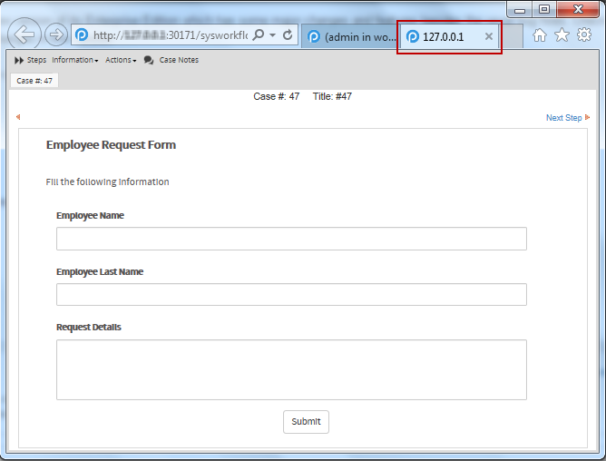
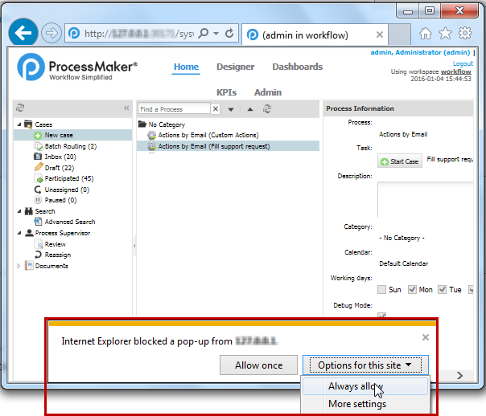

# Supported Browsers

## Browser Support Policy

ProcessMaker supports the current and previous major releases of Firefox, Google Chrome and Internet Explorer on a rolling basis. Each time a new version is released, we begin testing and then supporting that version and stop supporting the third most recent version.

 ProcessMaker supports the following desktop browser versions:

* Microsoft Internet Explorer 11
* Microsoft Edge:  Two latest stable releases
* Google Chrome:  Two latest stable releases
* Mozilla Firefox:  Two latest stable releases

## Considerations for Microsoft Internet Explorer 11

If using Internet Explorer, consider the following:

* ProcessMaker does not support [Enterprise Mode for Internet Explorer 11](https://docs.microsoft.com/en-us/internet-explorer/ie11-deploy-guide/enterprise-mode-overview-for-ie11).
* By default, the Internet Explorer Enhanced Security configuration is enabled on Windows Server 2003 and later. This feature can prevent ProcessMaker from displaying correctly in Internet Explorer and can restrict access to network resources. Therefore, disable this feature before working with ProcessMaker.
* Due to recent security updates on Internet Explorer 11, the "quirks mode" support has been removed. This mode was required by ProcessMaker to correctly display its frames in Internet Explorer. This was the reason why most of users accessing ProcessMaker on Internet Explorer 11 experienced many issues with the application \(especially in the **HOME** section\).

  ProcessMaker presents some solutions for those users who currently use Internet Explorer 11 to work with the application.

  * When a new case is created, the case is opened in a new tab.
  * When a case is opened, the case is opened in a new tab.
  * When a task of the case is completed, the tab for the current case is closed.

   


Take into consideration that the debug mode is not shown when working with ProcessMaker on Internet Explorer 11. DO NOT use Internet Explorer 11 to design processes.

When using Internet Explorer for the first time to open/create a case, it is probable that the browser does not open a new tab but shows the following message at the bottom:

`Internet Explorer has blocked a pop-up from <IP-ADDRESS> or <PROCESSMAKER_DOMAIN_NAME>`

To avoid receiving this message click on the down arrow next to **Options for this site** and select **Always allow**.

 

The page will be refreshed. Open/create the case one more time to open a new tab.


