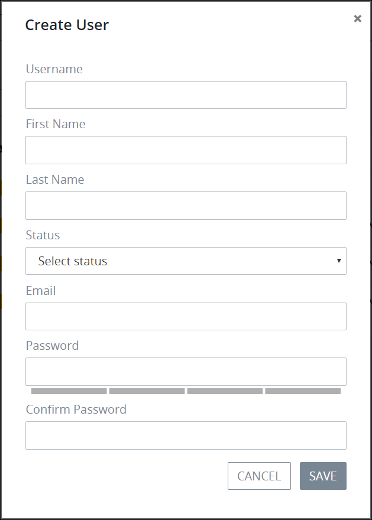

# Create a User Account


To create a ProcessMaker user account, you must be a member of the ProcessMaker Administrator group. Otherwise, the **Admin** option is not available from the top menu that allows you to perform user account management activities.


## Create a ProcessMaker User Account

Follow these steps to create a ProcessMaker user account:

1. [View all ProcessMaker user accounts.](manage-user-accounts/view-all-users.md) The **Users** page displays.
2. Click the **+USER** button. The **Add A User** screen displays.  

   

3. Enter in the **Username** field the username associated with the ProcessMaker user account.
4. Enter in the **First name** field the first name of the person associated with the ProcessMaker user account.
5. Enter in the **Last name** field the last name of the person associated with the ProcessMaker user account.
6. Select from the **Status** drop-down the status of the ProcessMaker user account using one of the following options:
   * **Active:** An Active ProcessMaker user account is one in which a person can use it to log in to ProcessMaker.
   * **Inactive:** An Inactive ProcessMaker user account is one in which a person cannot use it to log in to ProcessMaker.
7. Enter in the **Email** field the email address associated with the ProcessMaker user account.
8. Enter in the **Password** field the password associated with the ProcessMaker user account.
9. Confirm in the **Confirm Password** field that its value matches that of the **Password** field.
10. Select from the **Groups** drop-down the ProcessMaker group to which the ProcessMaker user account belongs if necessary. At least one ProcessMaker group must be created to assign a ProcessMaker group to any ProcessMaker user account. ~~A ProcessMaker user account may only have one ProcessMaker group assigned to it.~~ For information about ProcessMaker groups, see [Group Management](../assign-groups-to-users/).

    To change the ProcessMaker group, follow these guidelines:

    1. Click the iconfor the existing ProcessMaker group to no longer assign it to the ProcessMaker user account.
    2. Select the new ProcessMaker group from the **Groups** drop-down.

11. Click **Save**.

## Related Topics











