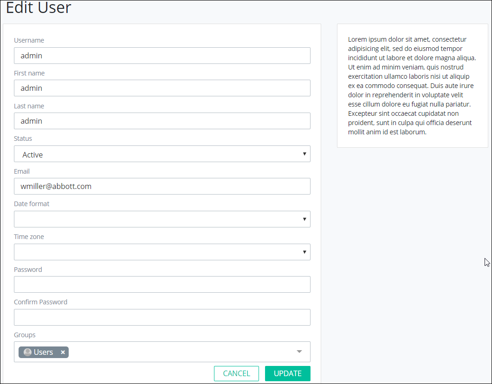

# Edit a User Account


To edit a ProcessMaker user account, you must be a member of the ProcessMaker Administrator group. Otherwise, the **Admin** option is not available from the top menu that allows you to perform user account management activities.


## Edit a ProcessMaker User Account

Follow these steps to edit a ProcessMaker user account:

1. [View all ProcessMaker user accounts.](view-all-users.md) The **Users** page displays.
2. Hover your cursor over the ProcessMaker use account to edit and then click the **Edit** icon. The **Edit User** page displays.  

   

3. Edit the username for the ProcessMaker user account in the **Username** field if necessary.
4. Edit the first name for the person associated with the ProcessMaker user account in the **First name** field if necessary.
5. Edit the last name for the person associated with the ProcessMaker user account in the **Last name** field if necessary.
6. Change the status of the ProcessMaker user account from the **Status** drop-down if necessary. Select one of the following options:
   * **Active:** An Active ProcessMaker user account is one in which a person can use it to log in to ProcessMaker.
   * **Inactive:** An Inactive ProcessMaker user account is one in which a person cannot use it to log in to ProcessMaker.
7. Edit the email address associated with the ProcessMaker user account in the **Email** field if necessary.
8. Change the format for how dates are displayed for the person using the ProcessMaker user account from the **Date format** drop-down from the following options:
   * mm/dd/yyyy
   * mm/dd/yyyy hh:mm \(12-hour clock\)
   * mm/dd/yyyy hh:mm \(24-hour clock\)
9. Change the time zone associated with the person using the ProcessMaker user account from the **Time zone** drop-down.
10. Edit the password associated with the ProcessMaker user account in the **Password** field.
11. Confirm in the **Confirm Password** field that its value matches that of the **Password** field.
12. Change the ProcessMaker group to which the ProcessMaker user account belongs if necessary. At least one ProcessMaker group must be created to assign a ProcessMaker group to any ProcessMaker user account. ~~A ProcessMaker user account may only have one ProcessMaker group assigned to it.~~ For information about ProcessMaker groups, see [Group Management](../../assign-groups-to-users/).

    To change the ProcessMaker group, follow these guidelines:

    1. Click the iconfor the existing ProcessMaker group to no longer assign it to the ProcessMaker user account.
    2. Select the new ProcessMaker group from the **Groups** field.

13. Click **Update**. Otherwise, click **Cancel** to not many changes to the ProcessMaker user account.

## Related Topics











