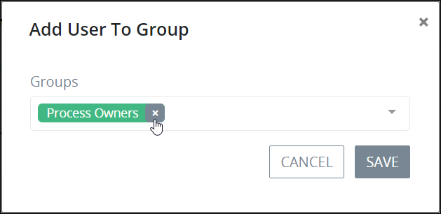

# Edit a User Account

## Edit a ProcessMaker User Account


Your user account or group membership must have the following permissions to edit a ProcessMaker user account:

* Users: View Users
* Users: Edit Users

Ask your ProcessMaker Administrator for assistance if necessary.


Follow these steps to edit a ProcessMaker user account:

1. [View all ProcessMaker user accounts.](view-all-users.md) The **Users** page displays.
2. Select the **Edit** icon. The **Information** tab displays for that ProcessMaker user account.  

   

3. Edit the following information in the **Information** tab about the person associated with the ProcessMaker user account if necessary:
   * In the **First Name** field, edit the person's first name.
   * In the **Last Name** field, edit the person's last name.
   * In the **Email** field, edit the person's email address.
   * In the **Phone** field, edit the person's business telephone or cell phone number.
   * In the **Address** field, edit the person's business address.
   * In the **City** field, edit the city for the person's business address.
   * From the **State or Region** drop-down, select the state, region, or province for the person's business address.
   * In the **Postal code** field, edit the person's business postal code.
   * From the **Country** drop-down, select the country for the person's business address.
   * From the **Date format** drop-down, select the format for how dates are displayed for this person from the following options:
     * m/d/Y \(12/31/2017\)
     * m/d/Y h:i A \(12/31/2017 11:30 pm\)
     * m/d/Y H:i \(12/31/2017 23:30\)
   * From the **Time zone** drop-down, select the time zone in which to display times for this person.
   * From the **Language** drop-down, select in which language to display ProcessMaker labels.
   * Select the avatar image to change the avatar for the ProcessMaker user account. If there is no avatar image, the letters for that person's first and last name display. When the avatar image is selected, the browse screen displays to select a new avatar image. Click the **Browse** button to locate the new avatar image. After selecting the new image click **Continue** from the browse screen.  

     

   * In the **Username** field, edit the username for the person's ProcessMaker user account.
   * From the **Status** drop-down, select the status of the ProcessMaker user account from the following options:
     * **Active:** An Active ProcessMaker user account is one in which a person can use it to log in to ProcessMaker.
     * **Inactive:** An Inactive ProcessMaker user account is one in which a person cannot use it to log in to ProcessMaker.
   * In the **New Password** field, edit the password to log in with the ProcessMaker user account. Leave the **New Password** field blank to keep the current password.
   * In the **Confirm Password** field, confirm that the password matches that entered into the **New Password** field if a new password was entered.
4. Click the **Groups** tab. The **Groups** tab displays the ProcessMaker [groups](../../assign-groups-to-users/what-is-a-group.md) of which that ProcessMaker user is a member.  

   

   The **Groups** tab displays the following information:

   * **Group:** The **Group** column displays the name of the group of which the ProcessMaker user is a member.
   * **Description:** The **Description** column displays the description of the group.

5. Change which ProcessMaker groups of which that ProcessMaker user in the **Groups** tab if necessary:
   * **Remove the ProcessMaker user from a ProcessMaker group:** Click the **Remove** iconfor that ProcessMaker group.
   * **Add the ProcessMaker user to a ProcessMaker group:** Click the **+Add User to Group** button. The **Add User To Group** screen displays. From the **Select a group** drop-down, select the ProcessMaker group to which the ProcessMaker user is a member, and then click **OK**. The ProcessMaker group displays in the **Groups** tab.  

     
6. Edit in the **Last name** field the last name for the person associated with the ProcessMaker user account if necessary.
7. Change from the **Status** drop-down the status of the ProcessMaker user account if necessary. Select one of the following options:
   * **Active:** An Active ProcessMaker user account is one in which a person can use it to log in to ProcessMaker.
   * **Inactive:** An Inactive ProcessMaker user account is one in which a person cannot use it to log in to ProcessMaker.
8. Edit in the **Email** field the email address associated with the ProcessMaker user account if necessary.
9. Change from the **Date format** drop-down the format for how dates are displayed for the person using the ProcessMaker user account if necessary. Select one of the following options:
   * mm/dd/yyyy
   * mm/dd/yyyy hh:mm \(12-hour clock\)
   * mm/dd/yyyy hh:mm \(24-hour clock\)
10. Change from the **Time zone** drop-down the time zone associated with the person using the ProcessMaker user account if necessary.
11. Edit in the **Password** field the password associated with the ProcessMaker user account if necessary.
12. Confirm in the **Confirm Password** field that its value matches that of the **Password** field.
13. Change from the **Groups** drop-down the ProcessMaker group to which the ProcessMaker user account belongs if necessary. At least one ProcessMaker group must be created to assign a ProcessMaker group to any ProcessMaker user account. For information about ProcessMaker groups, see [Group Management](../../assign-groups-to-users/).

    To change the ProcessMaker group for that user account, follow these guidelines:

    1. Click the iconfor the existing ProcessMaker group to no longer assign it to the ProcessMaker user account.
    2. Select the new ProcessMaker group from the **Groups** drop-down.

14. Click **Update**.

## Related Topics











