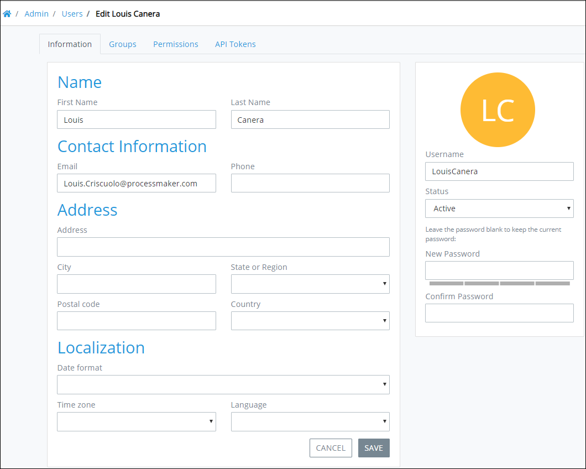
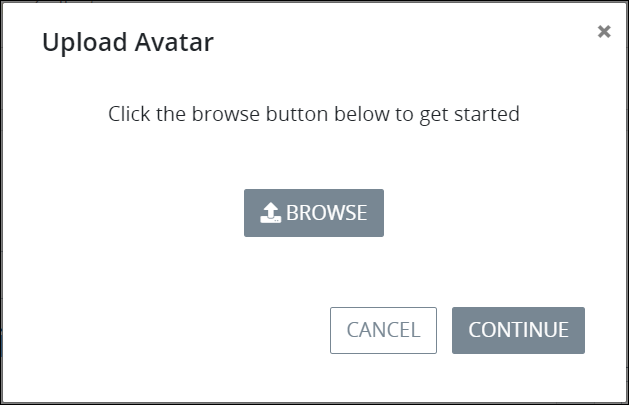

# Edit a User Account

## Edit a ProcessMaker User Account


Your user account or group membership must have the following permissions to edit a ProcessMaker user account:

* Users: View Users
* Users: Edit Users

Ask your ProcessMaker Administrator for assistance if necessary.


Follow these steps to edit a ProcessMaker user account:

1. [View all ProcessMaker user accounts.](view-all-users.md) The **Users** page displays.
2. Select the **Edit** icon for the ProcessMaker user account to edit. The **Information** tab displays for that ProcessMaker user account.  

   

3. Edit the following information in the **Information** tab about the person associated with the ProcessMaker user account as necessary:
   * In the **Name** section, change the following information:
     * In the **First Name** field, edit the person's first name.
     * In the **Last Name** field, edit the person's last name.
   * In the **Contact Information** section, change the following information:
     * In the **Email** field, edit the person's business email address. This is a required field.
     * In the **Phone** field, edit the person's business telephone or cell phone number.
   * In the **Address** section, change the following information:
     * In the **Address** field, edit the person's business address.
     * In the **City** field, edit the city for the person's business address.
     * From the **State or Region** drop-down, select the state, region, or province for the person's business address.
     * In the **Postal code** field, edit the person's business postal code.
     * From the **Country** drop-down, select the country for the person's business address.
   * In the **Localization** section, change the following information:
     * From the **Date format** drop-down, select the format for how dates are displayed for this person from the following options:
       * m/d/Y \(12/31/2017\)
       * m/d/Y h:i A \(12/31/2017 11:30 pm\)
       * m/d/Y H:i \(12/31/2017 23:30\)
     * From the **Time zone** drop-down, select the time zone in which to display times for this person.
     * From the **Language** drop-down, select in which language to display ProcessMaker labels.
   * Select the avatar image to change the avatar for the ProcessMaker user account. If there is no avatar image, the initials for that person's full name display. When the avatar image is selected, the **Upload Avatar** screen displays to select a new avatar image. Click the **Browse** button to locate the new avatar image. After selecting the new image click **Continue** from the **Upload Avatar** screen.  

     

   * In the **Username** field, edit the username for the person's ProcessMaker user account. This is a required field.
   * From the **Status** drop-down, select the status of the ProcessMaker user account from the following options:
     * **Active:** An Active ProcessMaker user account is one in which a person can use it to log in to ProcessMaker.
     * **Inactive:** An Inactive ProcessMaker user account is one in which a person cannot use it to log in to ProcessMaker.
   * In the **New Password** field, edit the password to log in with the ProcessMaker user account. Leave the **New Password** field blank to keep the current password. Passwords must be at least eight \(8\) characters long. [Password special characters](https://www.owasp.org/index.php/Password_special_characters) are recommended. Password validation indicates how strong your password is if you enter a new password.
   * In the **Confirm Password** field, confirm that the password matches that entered into the **New Password** field if a new password was entered. If you entered a new password, password validation indicates if the **New Password** and **Confirm Password** values do not match.
4. Click **Update** if you made any changes in the **Information** tab and do not need to make other changes in the ProcessMaker user account. Otherwise, continue.
5. Click the **Groups** tab. The **Groups** tab displays the ProcessMaker [groups](../../assign-groups-to-users/what-is-a-group.md) of which that ProcessMaker user is a member. If no groups have been created, the following message displays: **No Data Available**. See [Create a Group](../../assign-groups-to-users/create-a-group.md#create-a-processmaker-group).  

   

   The **Groups** tab displays the following information:

   * **Group:** The **Group** column displays the name of the group of which the ProcessMaker user is a member.
   * **Description:** The **Description** column displays the description of the group.

6. In the **Groups** tab, change which ProcessMaker groups of which that ProcessMaker user is a member if necessary:
   * **Remove the ProcessMaker user from a ProcessMaker group:** Click the **Remove** iconto remove the ProcessMaker user from the selected ProcessMaker group.
   * **Add the ProcessMaker user to a ProcessMaker group:** Click the **+Add User to Group** button. The **Add User To Group** screen displays. From the **Select a group** drop-down, select the ProcessMaker group to add the ProcessMaker user as a member, and then click **OK**. The ProcessMaker group displays in the **Groups** tab.  

     
7. Click the **Permissions** tab. The **Permissions** tab displays permissions assigned to that ProcessMaker user account.  

   

8. In the **Permissions** tab, change which permissions from each permission category to assign that ProcessMaker user account if necessary. Follow these guidelines to change permission assignments:
   * Select the **Make this user an admin** checkbox to assign all ProcessMaker Administrator related permissions to the ProcessMaker user account.
   * Select the **Assign all permissions to this user** checkbox to assign all permissions to the ProcessMaker user account.
   * Click on a permission category to expand the view of individual permissions within that category. Click on an expanded permission category to collapse that category. If you don't intend to assign this ProcessMaker user account with any group\(s\), then assign permissions to this user account. Note that if this ProcessMaker user account is assigned to any group\(s\), the permissions set in the group\(s\) take apply to those assigned to the user account. See [Permission Descriptions for Users and Groups](../../permission-descriptions-for-users-and-groups.md).
   * Click **Update** if you made any changes in the **Information** or **Permissions** tabs.


The **API Tokens** tab displays API tokens granted to that ProcessMaker user account. Only after the ProcessMaker user logs in can that person create API tokens.


## Related Topics

















