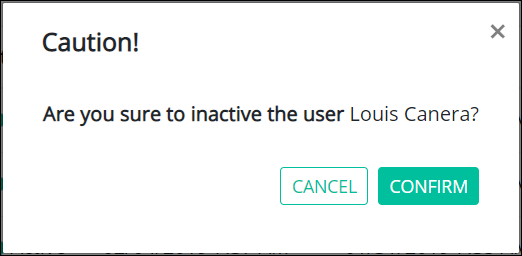

# Remove a User Account


To remove a ProcessMaker user account, you must be a member of the ProcessMaker Administrator group. Otherwise, the **Admin** option is not available from the top menu that allows you to perform user account management activities.


## Remove a ProcessMaker User Account


When a ProcessMaker user account is removed, the person assigned to that account can no longer log in to ProcessMaker.

Removing a ProcessMaker user account from the **Users** page cannot be undone.


Follow these steps to remove a ProcessMaker user account:

1. [View all ProcessMaker user accounts.](view-all-users.md) The **Users** page displays.
2. Hover your cursor over the ProcessMaker user account to remove and then click the **Remove** icon. The **Caution** screen displays to confirm the removal of the ProcessMaker user account.  

   

3. Click **Confirm** to remove the ProcessMaker user account. Otherwise, click **Cancel** to not remove the ProcessMaker user account.

## Related Topics











