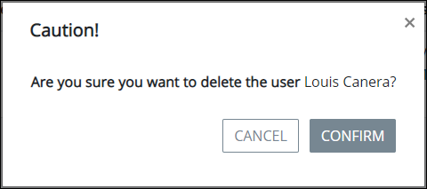

# Delete a User Account

## Delete a ProcessMaker User Account


Your user account or group membership must have the following permissions to delete a ProcessMaker user account:

* Users: View Users
* Users: Delete Users

See the [User](../../permission-descriptions-for-users-and-groups.md#users) permissions or ask your ProcessMaker Administrator for assistance.



When a ProcessMaker user account is deleted, the person assigned to that account can no longer log in to ProcessMaker.

Deleting a ProcessMaker user account from the **Users** page cannot be undone.


Follow these steps to delete a ProcessMaker user account:

1. [View all ProcessMaker user accounts.](view-all-users.md) The **Users** page displays.
2. Select the **Delete** iconfor the ProcessMaker user account. The **Caution** screen displays to confirm the deletion of the ProcessMaker user account.  

   

3. Click **Confirm**.

## Related Topics











