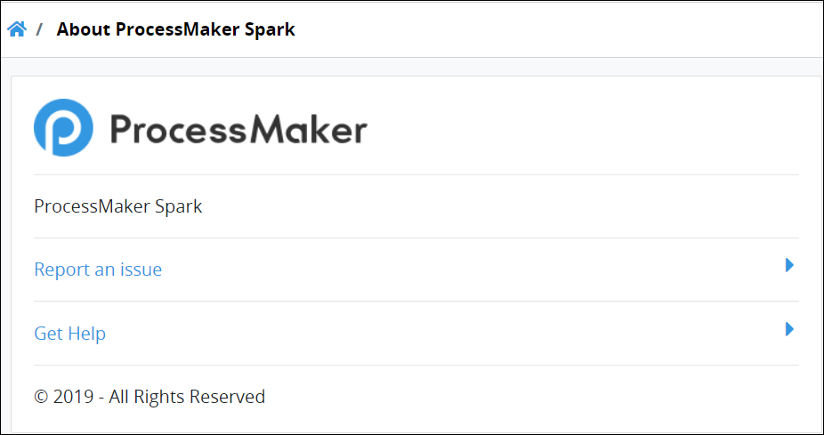

# View ProcessMaker Version Information


To view ProcessMaker version information, you must be a member of the ProcessMaker Administrator group. Otherwise, the **Admin** option is not available from the top menu that allows you to view ProcessMaker version information.


## View ProcessMaker Version Information

Follow these steps to view ProcessMaker version information:

1. [Log in](../using-processmaker/log-in.md#log-in) to ProcessMaker.
2. Click the **Admin** option from the top menu. The **Users** page displays.
3. Click the **App Version Details** icon. The **About ProcessMaker** page displays the ProcessMaker version.  

   


Click **Report an issue** to [report a ProcessMaker issue](https://github.com/ProcessMaker/bpm/issues).

Click **Get Help** to display [ProcessMaker's **bpm** GitHub repository page](https://github.com/ProcessMaker/bpm).


