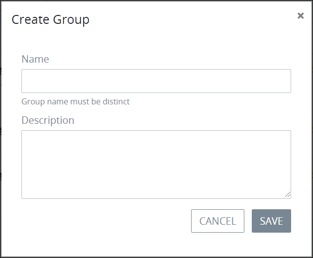

# Create a Group


To create a ProcessMaker group, you must be a member of the ProcessMaker Administrator group. Otherwise, the **Admin** option is not available from the top menu that allows you to perform group management activities.


## Create a ProcessMaker Group

Follow these steps to create a ProcessMaker group:

1. [View all ProcessMaker groups.](manage-groups/view-all-groups.md) The **Groups** page displays.
2. Click the **+GROUP** button. The **Create New Group** screen displays.  

   

3. Enter in the **Name** field the name of the ProcessMaker group. This is a required field.
4. Enter in the **Description** field a description of the ProcessMaker group.
5. Click **Save**.

## Related Topics















