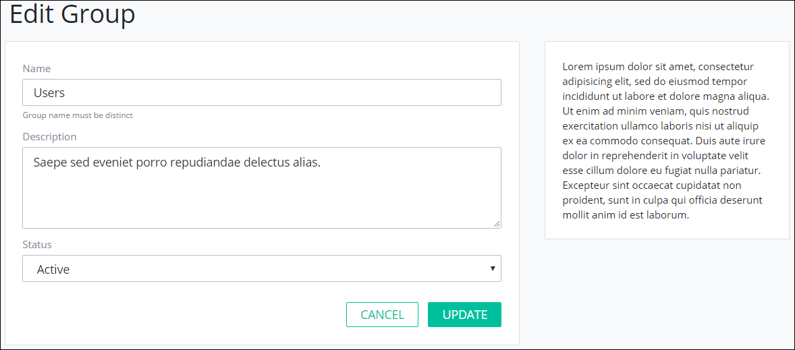

# Edit a Group


To edit a ProcessMaker group, you must be a member of the ProcessMaker Administrator group. Otherwise, the **Admin** option is not available from the top menu that allows you to perform group management activities.


## Edit a ProcessMaker Group

Follow these steps to edit a ProcessMaker group:

1. [View all ProcessMaker groups.](view-all-groups.md) The **Groups** page displays.
2. Hover your cursor over the ProcessMaker group to edit and then click the **Edit** icon. The **Edit Group** page displays.  

   

3. Edit in the **Name** field the name of the ProcessMaker group if necessary.
4. Edit in the **Description** field the description of the ProcessMaker group if necessary.
5. Change from the **Status** drop-down the status of the ProcessMaker group if necessary. Select one of the following options:
   * **Active:** An Active ProcessMaker group is one to which ProcessMaker user accounts can be assigned.
   * **Inactive:** An Inactive ProcessMaker group is one to which ProcessMaker user accounts cannot be assigned.
6. Click **Update**. Otherwise, click **Cancel** to not many changes to the ProcessMaker group.

## Related Topics















