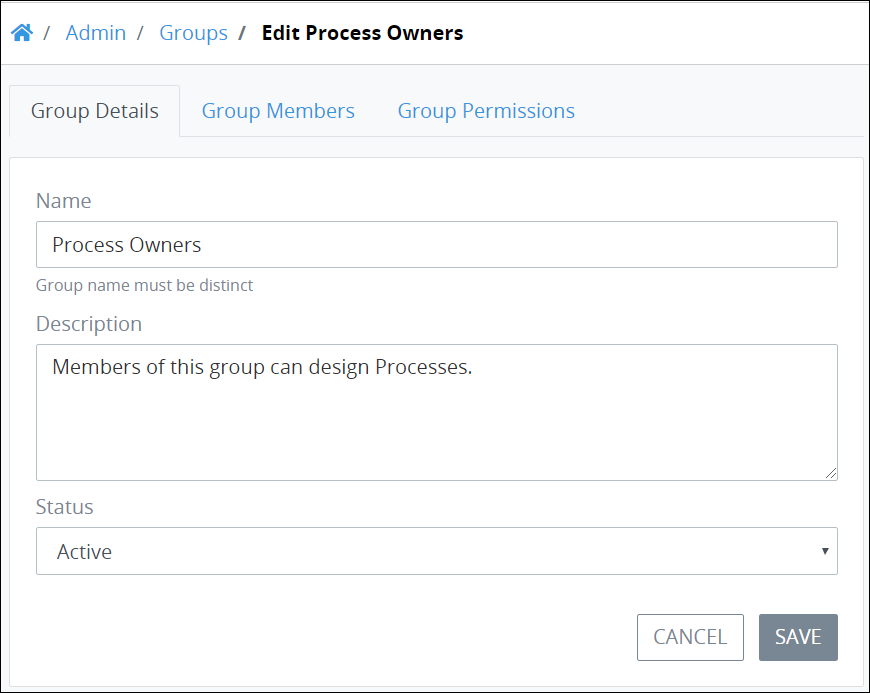
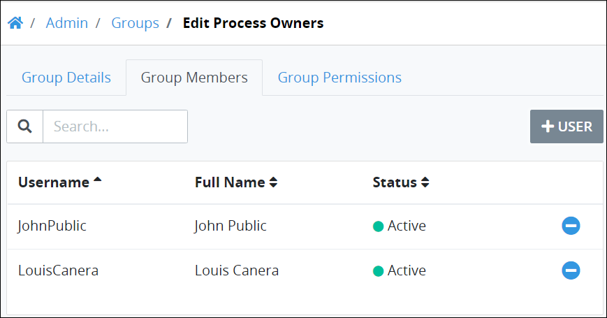
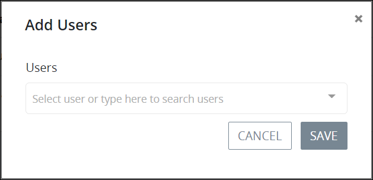

# Edit a Group

## Edit a ProcessMaker Group


Your user account or group membership must have the following permissions to edit a ProcessMaker group:

* Groups: View Groups
* Groups: Edit Groups

See the [Group](../../permission-descriptions-for-users-and-groups.md#groups) permissions or ask your ProcessMaker Administrator for assistance.


Follow these steps to edit a ProcessMaker group:

1. [View all ProcessMaker groups.](view-all-groups.md) The **Groups** page displays.
2. Select the **Edit** icon for the ProcessMaker group to edit. The **Group Details** tab displays.  

   

3. Edit the following information in the **Group Details** tab about the ProcessMaker group as necessary:
   * In the **Name** field, edit the name of the ProcessMaker group.
   * In the **Description** field, edit the description of the ProcessMaker group.
   * From the **Status** drop-down, select the status of the ProcessMaker group from one of the following options:
     * **Active:** An Active ProcessMaker group is one to which ProcessMaker user accounts can be assigned as members.
     * **Inactive:** An Inactive ProcessMaker group is one to which ProcessMaker user accounts cannot be assigned. When a ProcessMaker group becomes inactive, ProcessMaker user accounts that were members of that group are no longer members.
4. Click **Update** if you made any changes in the **Group Members** tab and do not need to make other changes in the ProcessMaker group. Otherwise, continue.
5. Click the **Group Members** tab. The **Group Members** tab displays which ProcessMaker user accounts are members of this group. If there are no group members, the following message displays: **No Data Available**.  

   

   The **Group Members** tab displays the following information:

   * **Username:** The **Username** column displays the ProcessMaker user account's username for the group member.
   * **Full Name:** The **Full Name** column displays the full name for the group member.
   * **Status:** The **Status** column displays the status of the ProcessMaker user account. See [Edit a User Account](../../add-users/manage-user-accounts/edit-a-user-account.md#edit-a-processmaker-user-account).
   * **Search:** Click the **Search** field and then enter text to filter the list of ProcessMaker user accounts. As you enter text into the **Search** field, ProcessMaker user accounts display that match your entered text.

6. In the **Group Members** tab, change which ProcessMaker user accounts are members of this ProcessMaker group by following these guidelines:
   * **Add ProcessMaker user accounts to the group:** 
     1. Click the **+User** button. The **Add Users** screen displays.  

        

     2. From the **Users** drop-down, select which ProcessMaker user account\(s\) to include as members of this ProcessMaker group by selecting the person's full name. In doing so, selected ProcessMaker user accounts display in the **Users** drop-down. You may click the Remove icon to remove a ProcessMaker user account from the **Users** drop-down.  

        

     3. Click **Save**. The ProcessMaker user accounts from the **Users** drop-down display in the **Group Members** tab.
   * **Remove ProcessMaker user accounts from the group:** 
     1. Select the **Delete** iconfor the ProcessMaker user account. The **Caution** screen displays to confirm the removal of the ProcessMaker user group.  

        

     2. Click **Confirm**.
7. Click the **Group Permissions** tab. The **Group Permissions** tab displays permissions assigned to all members of that ProcessMaker group. Permissions assigned to the ProcessMaker group take apply to all ProcessMaker user account members of this group.
8. In the **Group Permissions** tab, change which permissions from each permission category that are assigned to all group members if necessary. Follow these guidelines to change permission assignments:
   * Select the **Assign all permissions to this group** checkbox to assign all permissions to the members of this ProcessMaker group.
   * Click on a permission category to expand the view of individual permissions within that category. Click on an expanded permission category to collapse that category. Assign permissions for all members of this ProcessMaker Group. See [Permission Descriptions for Users and Groups](../../permission-descriptions-for-users-and-groups.md).
   * Click **Update** if you made any changes in the **Group Details** or **Permissions** tabs.

## Related Topics











