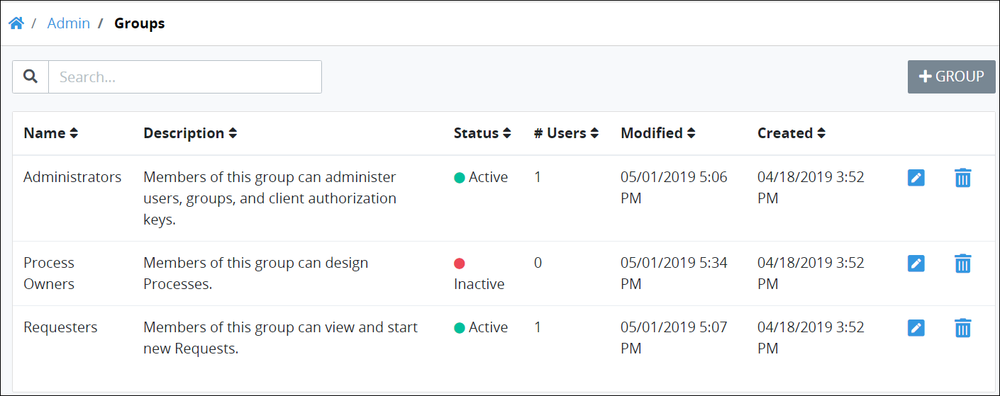

# View All Groups

ProcessMaker displays all ProcessMaker groups in one table that Process Administrators throughout your organization have created. This makes it easy to manage ProcessMaker groups.


To view ProcessMaker groups, you must be a member of the ProcessMaker Administrator group. Otherwise, the **Admin** option is not available from the top menu that allows you to perform group management activities.


## View All ProcessMaker Groups 

Follow these steps to view all ProcessMaker groups in your organization:

1. [Log in](../../../using-processmaker/log-in.md#log-in) to ProcessMaker.
2. Click the **Admin** option from the top menu. The **Users** page displays.
3. Click the **Groups** icon. The **Groups** page displays.

The **Groups** page displays the following information about ProcessMaker groups:

* **Name:** The **Name** column displays the name of the ProcessMaker group.
* **Description:** The **Description** column displays the description for the ProcessMaker group.
* **Status:** The **Status** column displays the status of the ProcessMaker group. For a description of possible status types, see [Edit a Group](edit-a-group.md).
* **Members:** The **Members** column displays how many ProcessMaker users are members of the ProcessMaker group.
* **Created At:** The **Created At** column displays the date and time the ProcessMaker group was created. ~~This column might change to "Created" and switch order with "Updated At/Modified" column.~~
* **Updated At:** The **Updated At** column displays the date and time the ProcessMaker group was last modified. ~~This column might change to "Modified" and switch order with the "Created At/Created" column~~.


For information how to search for a ProcessMaker group, see [Search for a Group](search-for-a-group.md).



If no ProcessMaker groups exist, the following message displays: ~~**You don't have any users. Please click on '+GROUP' to get started.**~~



[Control how tabular information displays.](../../../using-processmaker/control-how-requests-display-in-a-tab.md)


## Related Topics















