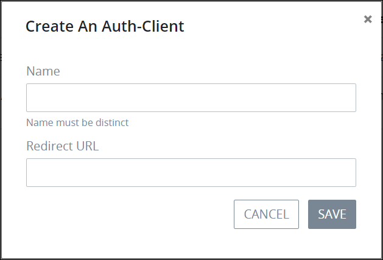

# Create a New Client Authentication Key

## Create a Client Authentication Key


~~Your user account or group membership must have the "Auth Client: View Auth Client" permission to create authentication keys.~~

~~See the Auth Client permissions or ask your ProcessMaker Administrator for assistance.~~


Follow these steps to create a client authentication key that grants access to the [ProcessMaker 4 REST API](https://develop-demo.bpm4.qa.processmaker.net/api/documentation):

1. [View all client authentication keys.](view-all-client-authentication-keys.md#view-all-scripts) The **Auth Clients** page displays.
2. Click the **+Auth Client** button. The **Create Auth Client** screen displays.  

   

3. In the **Name** field, enter the name of the client authentication key. ~~This is a required field.~~
4. In the **Redirect URL** field, enter the URL that redirects the authenticated client to your ProcessMaker 4 application server. ~~This is a required field.~~
5. Click **Save**. The new client authentication key displays in the **Auth Clients** page.

## Related Topics









